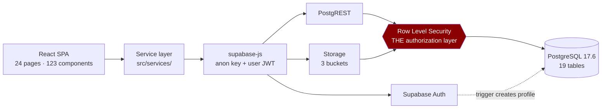

# ARTBANK — Presentation Notes

**Companion to `PROJECT_DOCUMENTATION.md`.** This file contains only what you need in the room: slide content, what to say, the technical explanations you must be able to give, and the questions you will be asked.

**Prepared:** 27 August 2026 · **Repository state:** commit `35ad5bb`, working tree clean, type check and lint both passing.

---

## Contents

- [Before you start: five facts you cannot get wrong](#before-you-start-five-facts-you-cannot-get-wrong)
- [The system, as intended](#the-system-as-intended)
- [The three explanations (30s / 1min / 3min)](#the-three-explanations)
- [Slide-by-slide content and speaking notes](#slide-by-slide)
- [Live demo script](#live-demo-script)
- [Key technical explanations you must be able to give](#key-technical-explanations)
- [Likely evaluator questions](#likely-evaluator-questions)
- [Danger zones — what not to claim](#danger-zones)
- [One-page fact sheet](#one-page-fact-sheet)

---

## Before you start: five facts you cannot get wrong

1. **There is no application server in the live path.** The browser talks directly to Supabase's generated REST API. All authorization is Row Level Security in PostgreSQL.
2. **`server/` contains a complete OIDC backend that nothing calls.** It's built, it type-checks, it is not connected. Say so before anyone finds it.
3. **JO1N ID is a third-party service, connected for authentication only.** It's a separate identity product built by another team. ARTBANK calls it to sign users in — it has no role in artworks, enquiries or messaging. You wrote the integration; you did not write the provider.
4. **The ArtSpace "Today" dashboard is static demo data.** It's the first screen after sign-in. Either skip it in the demo or name it as the gap you'd close first.
5. **There are no tests.** Don't defend it — know exactly what you'd test first (RLS policies).

---

## The system, as intended

*This is what ARTBANK **is** as a finished product. Use it whenever someone asks "what is it?" — describe the system, then let Slide 13 handle how much is built.*

> ARTBANK is the professional infrastructure an artist's work needs in order to be taken seriously — documentation, provenance, rights, controlled visibility and identity-gated contact — supplied directly to the artist instead of through a gallery.

**Two workspaces behind one public site**

- **ArtSpace** — the artist documents each artwork as a complete record: details, images with declared roles, private evidence documents, pricing and shipping, explicitly granted permitted uses, a visibility setting, and an append-only history. From there they manage the portfolio, read who has shown genuine interest, review opportunities matched to their practice with a stated reason, and hold structured conversations.
- **The buyer workspace** — buyers discover published work, save it, and file a Buyer Intent Card to get price, availability, licensing or private access. That card is the only route to an artist.
- **The public surface** — an Artists directory and a public profile per artist at their own handle, showing exactly what that artist chose to expose.

**Three commitments that define it**

1. **Identity before access.** A visitor may look. Anything more requires saying who you are, what you want it for, and consenting to that reaching the artist. Anonymous traffic is a count, never a person.
2. **The artist decides what is visible.** Visibility, contact disclosure, price disclosure and permitted uses are separate opt-in switches. A new record starts private with nothing permitted.
3. **The platform never invents a fact about an artist.** No valuation, no popularity score, no ranking, no estimated earnings, no unexplained recommendation.

Plus: a minor artist's account is linked to a verified guardian, and no external contact reaches them without the guardian routed into it.

**And one boundary worth stating up front:** authentication is delegated to a third-party identity provider. ARTBANK never handles a password. That provider is someone else's system, connected for sign-in only.

---

## The three explanations

### 30 seconds — "What is your project?"

> ARTBANK is a platform that helps artists turn each artwork into a proper professional record — the details, the images, the evidence, the rights — instead of just a photo on Instagram. And when a buyer wants a price or wants to talk, they have to say who they are and what they want it for first. So the artist gets a documented body of work, and real enquiries from named people instead of anonymous "how much?" messages. It's a React and TypeScript app on a Supabase Postgres database, where the security rules live in the database itself.

*Delivery note: the last sentence is what turns it from a product pitch into a technical answer. Don't drop it.*

### 1 minute

> Most artists sell through Instagram. That means an artwork has no real record — just a photograph — and every enquiry is an anonymous message with no name and no stated purpose. The artist can't tell a curator from a time-waster, and rebuilds the same details from memory for every conversation.
>
> ARTBANK gives each artwork a structured record: medium, dimensions, edition, provenance, evidence documents like ownership proofs and certificates, explicit rights and permitted uses, and a visibility setting the artist controls. Then it changes how contact works. A buyer who wants price, availability, licensing or private access has to fill in a Buyer Intent Card — who they are, their role, their purpose, their budget band, their timeline. There is no anonymous enquiry.
>
> It's built with React 19 and TypeScript on Vite, with Supabase Postgres as the backend. There's no application server in the live path — the browser talks straight to the database, so all authorization is Row Level Security policies. The product's rules are database constraints, not UI conventions: an enquiry that claims to be identified but has nobody attached physically cannot be stored, and a conversation involving a minor is rejected unless a verified guardian is attached.

### 2–3 minutes (presentation-ready)

> **The problem.** Artists today run their whole commercial life through social media, and it fails them in specific ways. An artwork post is a photograph, not a record — no medium, no dimensions, no provenance, no rights. Enquiries arrive anonymously, so an artist can't tell which of twenty messages is a real gallery. And nothing states what may legally be done with the image, so people assume. Young artists are exposed to direct adult contact with no oversight. The alternatives don't solve it either: galleries do the documentation but take a large commission and accept very few artists; marketplaces treat art as retail stock and add popularity leaderboards that punish exactly the emerging artists who need help.
>
> **The solution.** ARTBANK does two things. First, it turns an artwork into a **record**: a five-step flow captures details, images with declared roles, pricing and shipping, private evidence documents like ownership proofs and certificates, and explicitly ticked permitted uses — and every artwork carries an append-only history of everything that has happened to it. Second, it turns an enquiry into a **disclosure**: the Buyer Intent Card. Any buyer who wants price, availability, licensing or a private viewing fills in the same form — purpose, role, organization, budget band, timeline, message — and their name and country come from their own account. Filing that card writes into the artist's ledger *and* opens a message thread, in one action.
>
> **What's built.** An artist can sign up, document and publish artworks, upload images and private evidence documents, manage a portfolio with bulk actions and CSV export, run a public profile at their own handle, read identified enquiries, and hold structured conversations. A buyer can discover published work, save it, file an intent card, and track enquiries. Two separate workspaces, one shared data layer — the buyer's "My Enquiries" and the artist's "Interest Ledger" read the same database row from opposite ends, so they can never disagree.
>
> **The technology.** React 19, TypeScript, Vite, React Router, CSS Modules. The backend is Supabase Postgres. There is deliberately no application server in the live path — the browser talks directly to a generated REST API, which means **all** authorization is Row Level Security policies in the database. Thirty-plus policies across nineteen tables. Sign-in is designed to be delegated to a third-party identity provider, so ARTBANK never handles a password; I've written that integration as a Fastify backend using OpenID Connect with PKCE, and it's not yet connected because the provider isn't live. Authentication is a swappable edge — nothing else in the system depends on which provider is behind it.
>
> **The impact — and what I'd point at.** The interesting part isn't the screens; it's that the product's ethics are enforced by the database. There's a check constraint that makes it physically impossible to store an enquiry that claims to be identified but has nobody attached. There's a trigger that refuses to create a conversation involving a minor without a verified guardian. There's a constraint that prevents any application from being marked submitted without a named human approver. And where the interface can't do something honestly — the earnings figure with no recorded deal behind it, a response rate that would need to read other people's messages — it shows nothing rather than an invented number. That principle changed the schema, not just the copy.

---

## Slide-by-slide

*Fifteen slides. Bullets are what goes on the slide; the notes underneath are what you say.*

---

### Slide 1 — Title

**On the slide**
- **ARTBANK**
- *Making every artwork easier to prove, present and earn from*
- [Your name] · [Course] · [Date]

**Say**
> ARTBANK is a platform for artists to document their work professionally, and for buyers to reach them — but only by identifying themselves first.

*Keep this to two sentences. The problem slide does the work.*

---

### Slide 2 — Problem Statement

**On the slide**
- Artists sell through Instagram — a post is a **photograph, not a record**
- Anonymous *"how much?"* — no name, no purpose, no way to filter serious enquiries
- Rights undefined by default; people assume
- The same details rebuilt from memory for every enquiry
- Minors reachable directly by any adult
- Galleries solve it — but take a large cut and accept very few

**Say**
> Ask an artist on Instagram what medium a piece is, its exact dimensions, whether it's signed, whether it's an original or an edition, and whether they hold the rights to license it — and they'll rebuild the answer from memory, from old messages, from photos on their phone. Every time. For every enquiry.
>
> And they can't tell which enquiries deserve that effort, because a message from a curator and a message from a time-waster look identical.

*Delivery note: this is the slide where you make the audience feel the problem. Slow down. The "every time, for every enquiry" line is the one that lands.*

---

### Slide 3 — Proposed Solution

**On the slide**
- **Record, not photograph** — details, images, evidence, rights, provenance
- **Disclosure, not message** — the Buyer Intent Card gates every serious request
- **Permission-first** — new artworks start private, with nothing permitted
- **Nothing invented** — no valuation, no ranking, no estimated earnings
- Rules enforced in the **database**, not just the interface

**Say**
> Two mechanisms carry the whole product. An artwork becomes a structured record with evidence behind it. And an enquiry becomes a disclosure — anyone who wants price, availability, licensing or private access fills in the same form, and their identity comes from their own account.
>
> The fourth bullet is the one I'd draw attention to. The platform never invents a number about an artist. If there's no recorded sale, the interface says "No earnings" — not "0" — because those are different claims.

---

### Slide 4 — Objectives

**On the slide**
1. Give every artwork a durable, evidence-backed record
2. Make every serious enquiry carry an identity and a stated purpose
3. Put visibility, pricing disclosure and rights under the artist's control, field by field
4. Protect minors with enforced guardian routing
5. Never present an estimate, ranking or invented statistic as fact

**Say**
> Objective five sounds like a content guideline. It turned out to be a database design constraint, and I'll come back to that.

*Delivery note: plant the hook here, pay it off on Slide 12.*

---

### Slide 5 — Target Users

**On the slide**
- **Artists** — emerging and early-career · the primary user
- **Buyers, collectors, galleries, organizations** — sourcing with real information
- **Guardians** — for minor accounts *(enforced in the database; interface not built)*
- **Partners, admins** — modelled in the schema, no interface yet

**Say**
> Two working journeys — artist and buyer. Three more roles exist in the data model. I've flagged the guardian one because the enforcement is genuinely built and the interface isn't, and I'd rather say that here than have it discovered later.

*Delivery note: this early admission buys you enormous credibility for the rest of the talk. Do not skip the parenthetical.*

---

### Slide 6 — Key Features

**On the slide**
- **Add Artwork** — five steps, real validation, nothing auto-populated
- **Artwork Record** — seven tabs: overview, passport, interest, opportunities, rights, earnings, history
- **My Works** — filter, search, bulk actions, CSV export, guarded delete
- **Public profile** — own handle, per-field visibility switches
- **Interest Ledger** — identified people named, anonymous traffic counted only
- **Buyer Intent Card** — the single gate to price, availability, licensing, private access
- **Messages** — every thread carries its artwork, category and purpose

**Say**
> Two details worth pulling out. "Guarded delete" — you can only delete an artwork that has nothing recorded against it. No interest, no opportunities, no earnings. Everything else archives instead, because deleting a work that has provenance destroys that provenance.
>
> And the Interest Ledger: identified people get a row, anonymous traffic gets a number. Never a row. That's not a UI choice — the database won't store an anonymous entry with a person attached, or an identified one without.

---

### Slide 7 — System Workflow

**On the slide**
- Sign up → role chosen → **database trigger** creates the profile
- `/workspace` reads the role → routes to ArtSpace or Collect
- Artist documents → publishes → the record goes public
- Buyer discovers → files an Intent Card
- **One row, two screens** — the buyer's enquiry *is* the artist's ledger entry
- Both sides converse in a thread the enquiry opened

**Diagram to include**

```
        Buyer files the Intent Card
                    │
                    ▼
        ┌────────────────────────┐
        │   interest_entries     │
        │      (ONE row)         │
        └────────────────────────┘
             │              │
   viewer_id │              │ artist_id
             ▼              ▼
    /collect/enquiries   /artspace/interest
     "My Enquiries"      "Interest Ledger"
```

**Say**
> This is the design decision I'm most pleased with. The buyer's enquiry and the artist's ledger entry aren't two records that need to stay in sync — they're the same row, read from opposite ends. There's no synchronisation step and no duplicated status column, so the two sides physically cannot disagree about what was asked.

*Delivery note: if you explain one thing well in the whole presentation, make it this.*

---

### Slide 8 — System Architecture

**On the slide**
- React SPA → `supabase-js` → PostgREST → **Row Level Security** → PostgreSQL
- **No application tier in the live path** — the key decision
- Consequence: *all* authorization is RLS policies (30+ across 19 tables)
- Service layer (`src/services/`) is the only code that touches the database
- Sign-in delegates to a **third-party identity provider** — the integration is written in `server/`, **not yet connected**

**Diagram to include** — use the Mermaid diagram from `PROJECT_DOCUMENTATION.md` Section 7.2, or this simplified version:



**Say**
> The red box is the whole point. Because the browser talks straight to a generated REST API, there is nowhere to put an `if user.id !== artwork.artist_id, throw`. Every authorization rule had to become a policy in the database.
>
> That's a trade-off with two sides. The upside is that a rule written as a policy applies to every client, forever — including me in the SQL editor. The downside is there's no second line of defence: a missing policy is a public table.

---

### Slide 9 — Technology Stack

**On the slide**

| Layer | Choice |
|---|---|
| Frontend | React 19, TypeScript 6, Vite 8, React Router 7 |
| Styling | CSS Modules (132) + design tokens; Tailwind for auth screens only |
| Backend | Supabase — PostgREST, Auth, Storage |
| Database | PostgreSQL 17.6 · 19 tables · 23 migrations |
| Security | Row Level Security · CHECK constraints · triggers |
| Sign-in integration *(built)* | Fastify 5 · OIDC + PKCE · `jose` JWKS — connects to a third-party provider |
| Tooling | oxlint · tsc · tsx — **both checks pass clean** |

**Say**
> One row needs explaining. Tailwind is confined to the authentication screens, because those are a verbatim port of a supplied design bundle. I deliberately left out Preflight — Tailwind's global element reset — because it would have overridden my own global stylesheet and restyled all 123 components in the application.

*Delivery note: if asked "why two styling systems?", that's the answer. It's a containment decision, not indecision.*

---

### Slide 10 — Database

**On the slide**
- 19 tables · 23 hand-written, re-runnable migrations
- **Three constraints that carry the product's ethics:**
  - Identity **or** anonymity — never a half-state
  - Nothing auto-submits without a named human approver
  - A minor's conversation requires a verified guardian *(trigger)*
- Provenance log has **no update or delete policy** — by design
- 3 storage buckets: two public, one **private** with 5-minute signed URLs

**Include this constraint on the slide:**

```sql
check (
  (is_identified = true  and viewer_id is not null
                         and identity_sharing_consent = true) or
  (is_identified = false and viewer_id is null)
)
```

**Say**
> That constraint is the Interest Ledger's hard rule expressed as something the database enforces rather than something my interface promises. An enquiry that claims to be identified but has nobody attached cannot be stored. An anonymous row has no identity to leak, because there's physically nothing there.
>
> And the provenance log deliberately has no update or delete policy. A log that can be rewritten isn't provenance.

---

### Slide 11 — Key Screens

**On the slide** — screenshots, minimal text:
1. Add Artwork wizard — step 1 (validation) and step 5 (publish)
2. My Works — the management table with a row menu open
3. Artwork Record — the History tab
4. Buyer Discover feed
5. The Buyer Intent Card dialog
6. Public artist profile — Contact first, Follow second

**Say**
> One thing to notice on the public profile: Contact comes first, Follow second, social links third. That ordering is a specification requirement, reversing an earlier design where social icons dominated — the point being that the platform's job is to produce a conversation, not to send traffic to Instagram.

*Delivery note: if you're doing a live demo, replace this slide with the demo and keep the screenshots as backup.*

---

### Slide 12 — Challenges

**On the slide**
- **A mid-project pivot** — solved with expand-and-contract migrations; a deprecated column kept deliberately so nothing broke
- **A reversed decision** — migration `0019` announces it in its own header, with reasoning
- **No server to authorize in** — every rule became an RLS policy, via one helper function
- **Refresh-token rotation** — a race that would log users out; solved with a conditional-`UPDATE` lock in Postgres
- **Guardian rule needed subqueries** — so it became a trigger, which makes it hold for *any* client
- **"No fake statistics"** — turned out to be a schema constraint, not a copy rule

**Say (pick two — don't rush all six)**

*The pivot:* > This project started as a public marketplace with a rankings leaderboard. A brief then redefined it as a private, artist-first documentation tool. Deleting features is easy; deleting columns that other code still reads is not. I used expand-and-contract — one column is still in the schema, marked deprecated in a Postgres comment, specifically so the homepage query didn't break the moment the migration ran.

*The statistics one — pays off Slide 4:* > I said objective five turned out to be a database constraint. Here's what I mean. If an artwork has no recorded sale, the code returns `null` for earnings, not zero — because "nothing recorded" and "zero" are different claims. Sorting by earnings puts null last rather than treating it as zero. I cut the response-rate figure from the buyer's artist card entirely, because computing it honestly would require reading other people's message threads — which Row Level Security correctly refuses to hand over. And opportunity matches have a `NOT NULL` column called `why_text`, so a match that can't explain itself cannot exist as a row.

---

### Slide 13 — Results

**On the slide**
- ✅ Type check and lint both pass clean · 59 commits over three weeks
- ✅ **Artist journey end to end** — document → publish → profile → enquiry → conversation
- ✅ **Buyer journey end to end** — discover → save → intent card → track
- ✅ 8 of 12 specification completion-test items pass cleanly
- ⚠️ Today dashboard is static; opportunity matches are seeded, not computed
- ⚠️ Guardian protection enforced in the database — no interface yet
- ⚠️ The OIDC backend is written but not connected
- ⚠️ No automated tests

**Say**
> Eight clean passes out of twelve on the specification's own completion test, four partial. I've listed the partials rather than the passes, because those are the ones you'd want to ask me about anyway.

*Delivery note: leading with your own limitations here is a strength move. It also front-runs half the Q&A.*

---

### Slide 14 — Future Improvements

**On the slide**
- **Immediate** — mark messages read · tighten the public-profile policy to columns · scope image uploads by path · wire Today to real data · add a "record a sale" form
- **Medium** — connect the OIDC backend · build the guardian interface · make the enquiry write atomic via `rpc` · server-side pagination · RLS regression tests
- **Long** — public Smart Artwork Link with server-rendered previews · real opportunity matching *(must generate `why_text`)* · artist-side viewing rooms · COA review workflow
- **Deliberately excluded** — rankings, likes, valuation, auctions, tokenization

**Say**
> The last line matters. Those aren't things I ran out of time for — they're banned by the project's own guardrail document. A leaderboard measures existing audience, not quality, so it would actively disadvantage exactly the emerging artists this platform exists for. This project *had* a rankings page. I deleted it.

---

### Slide 15 — Conclusion

**On the slide**
- ARTBANK gives artists the two things they most lack: **documentation** and **filtered attention**
- The product's principles are enforced by the **database**, so they hold for every client
- Where a feature couldn't be finished honestly, the interface **says so on screen**
- Built to a hard deadline, through a mid-project pivot, with the reasoning recorded in the migrations
- Foundation is complete — the next milestones are **completions, not new architecture**

**Say**
> If I've done one thing well here, it's this: the rules that make this product what it is aren't in my JavaScript, where a second client could bypass them. They're in the database, where they hold for everything — including me. And where I couldn't finish a feature honestly, the interface says so on screen rather than implying a capability that isn't there.
>
> A prototype that quietly implies things it can't do is worse than one that names its own edges.

*Delivery note: end on that last sentence. Don't add anything after it.*

---

## Live demo script

**Before you begin:** have the app running (`npm run dev`), be signed in as an artist account that owns the seeded library (run `select public.claim_seed_artist('your@email.com');` in the Supabase SQL editor beforehand), and have a second browser profile signed in as a buyer.

### The eight-minute route

| # | Do this | Say this |
|---|---|---|
| 1 | Start on `/` | *"Public site. Note there are no prices, no likes and no rankings anywhere — that's deliberate."* |
| 2 | `/artspace/works` — **skip Today** | *"This is the artwork management screen. Not a gallery — every row carries status, availability, documentation state, real interest count and recorded earnings."* |
| 3 | Open a row menu | *"Delete is only offered for records with nothing recorded against them. Everything else archives, because deleting a work with provenance destroys that provenance."* |
| 4 | `+ Add Artwork` — fill step 1, submit with a field missing | *"Validation is real, and step 1 saves an actual draft. Its id carries through every later step."* |
| 5 | Jump to an existing record → **History tab** | *"Append-only provenance log. The table deliberately has no update or delete policy — a log you can rewrite isn't provenance."* |
| 6 | `/artspace/profile` → flip a visibility switch | *"Every disclosure is a separate opt-in. Show contact information defaults to off. Show prices defaults to off. Allow enquiries defaults to on, because reaching the artist is the point."* |
| 7 | **Switch to the buyer window** → `/collect` → open an artwork | *"Same data, other side. Notice the price says 'on request' — that needs two separate permissions to both say yes: the artist's profile switch AND the record's own pricing choice."* |
| 8 | Press **Request Availability** → show the dialog → submit | *"Three different buttons, one form. Anything beyond looking requires identity and stated purpose."* |
| 9 | **Back to the artist window** → `/artspace/interest` | *"Same row. The buyer's enquiry and my ledger entry are one database record read from opposite ends."* |
| 10 | `/artspace/messages` | *"And the enquiry opened this thread with the buyer's message already in it."* |

### Demo hazards

| Risk | Mitigation |
|---|---|
| You open `/artspace` (Today) and someone asks where the numbers come from | **Skip it.** If you land there, say immediately: *"This dashboard is the one screen still showing sample data — it's my first fix."* |
| Nothing is published, so Discover shows the demo set | The screen labels itself *"Sample works"*. Point at the label: *"Every fallback in this app says so."* |
| Unread badge doesn't clear after reading | True and known. *"Nothing writes `read_at` yet — one UPDATE statement, top of my immediate list."* |
| Followers panel shows people who aren't real | *"That panel is still demo — the `profile_follows` table exists, the panel just isn't wired to it."* |
| Someone asks to see the third-party sign-in | It isn't connected — the provider isn't live. Show `server/src/index.ts` and walk the flow on Slide 8's diagram. |

---

## Key technical explanations

*Practise saying each of these out loud. Two minutes each, maximum.*

### 1. What Row Level Security actually is

> A Postgres feature that attaches rules to a table saying which rows a given user may see or change. When my app queries `interest_entries`, Postgres evaluates the policy per row — and rows that don't match simply aren't in the result. It's a filter, not an error.
>
> That last part matters. If a policy doesn't match on a SELECT, you get fewer rows, not a refusal. Which is why some of my services treat "no rows" carefully — sometimes it genuinely means nothing's there, sometimes it means the migrations haven't run. My Works falls back to demo data in that case; Saved Works deliberately doesn't, because an empty save list is a real answer and falling back would mean nothing a buyer removed ever looked removed.

### 2. Why every policy calls one function

> `auth.uid()` gives me the Supabase Auth user id. But almost every table in my schema foreign-keys to `public.users.id`, which is a different id — the two are joined by `users.auth_user_id`. Every policy needs that hop.
>
> So it lives in one `SECURITY DEFINER` function, `current_user_id()`, rather than being repeated as a subquery in thirty policies. `SECURITY DEFINER` is required because the function itself reads a table that's under RLS, and `set search_path = public` is the standard hardening for that.

### 3. The refresh-token lock — your strongest technical story

> The identity provider rotates refresh tokens. Every refresh mints a new one and consumes the old, and presenting an already-consumed token is treated as a reuse attack — it revokes the whole token family and kills the session.
>
> So two browser tabs hitting an expired token at the same moment is actively dangerous. Both read the same stored refresh token, both call the provider, and the second one looks exactly like an attacker replaying a consumed token. The user gets logged out through no fault of their own — and it's a race, so it'd be intermittent and horrible to debug.
>
> I solved it with a conditional UPDATE as a distributed lock. `UPDATE sessions SET refreshing_at = now() WHERE id = ? AND (refreshing_at IS NULL OR refreshing_at < stale) RETURNING id`. Only one caller's update returns a row — Postgres settles the race. That caller talks to the provider; the losers poll for up to a second and a half and take the winner's result. There's a staleness window so a crashed lock-holder doesn't deadlock the session forever.
>
> The reason I'd point at this one: an in-memory mutex would have looked correct and been wrong, because it wouldn't survive more than one server process. Using the database as the coordination point is the thing I actually learned.

### 4. Why the enquiry is written before the conversation

> Without transactions, one of the two writes can fail. So I asked which partial failure is worse.
>
> Conversation written, enquiry failed: the artist has a message thread that isn't in their ledger — an enquiry that doesn't exist as a record. Enquiry written, conversation failed: the artist has a fully recorded enquiry with identity, purpose, budget and message, and just no thread yet.
>
> The second is obviously better, so the enquiry goes first and the conversation function returns null instead of throwing. And it isn't hypothetical — the guardian trigger reliably refuses a conversation involving a minor without a linked guardian. That's correct behaviour, and no buyer-side form can supply a guardian. If I'd ordered the writes the other way, the guardian protection would have silently destroyed legitimate enquiries.

### 5. `status` versus `visibility`

> Two separate columns on `artworks`, deliberately. Status is how *finished* the record is — draft, published, archived. Visibility is *who may see it* — public, private, unlisted.
>
> Collapsing them into one column makes "published but temporarily hidden" impossible to express, and that's exactly the state an artist wants when a piece is at a gallery or being rephotographed.
>
> There's a good story attached. The original read policy checked only `status = 'published'`, because at that point status was the only thing gating a row. A later migration added `visibility` — and didn't update the policy. So an artist could publish a record, set it back to Private, and it stayed readable by anyone with the anon key. The Discover feed filtered on visibility, but that was app-level and fetching by id bypassed it entirely. Migration `0023` fixed it and says so in its own header. I mention it because that's precisely the failure mode of putting authorization in policies: they don't automatically know about columns added later.

### 6. Why PostgREST needs foreign-key hints

> `conversations` references `users` twice — `artist_id` and `buyer_id`. When I ask PostgREST to embed the related user, it refuses, because it can't tell which relationship I mean. I have to name the constraint: `users!conversations_buyer_id_fkey(...)`.
>
> Same problem on `artworks` (`artist_id` and `uploaded_by`), `interest_entries` (`artist_id` and `viewer_id`) and `artwork_deals` (`artist_id` and `buyer_id`).
>
> It's also what makes the two-sided mailbox work. One mapper serves both workspaces, with a `side` parameter picking which column is "me" and which FK hint is "them" — which is why the artist's and buyer's inboxes can't drift apart.

### 7. Why the private document bucket exists

> Artwork images go in a public bucket — they're meant to be seen. Evidence documents don't: they're ownership proofs, invoices and appraisals, and they're the basis of a certificate review.
>
> So `artwork-documents` is created with `public: false`, and viewing a file mints a signed URL that expires in 300 seconds. The migration explains why that matters — RLS already declared those rows private, and a public bucket would have made that policy decorative, because anyone with the URL could read the file regardless.

---

## Likely evaluator questions

*Twenty questions. Full answers are in `PROJECT_DOCUMENTATION.md` Section 17 — these are the compressed versions to have in your head.*

### On the project and technology

**Q: Why this project?**
> The problem is specific, not generic — social media gives artists a photograph where they need a record, and an anonymous message where they need a named enquiry. And it had good technical shape: how do you model "identified vs anonymous" so it can't be faked, how do you protect a minor in a way that survives someone bypassing your UI, how do you record provenance so it can't be rewritten. Those are database questions, and that's what I learned most from.

**Q: Why React / TypeScript / Vite?**
> React because it's a dense state-heavy app — a wizard carrying a draft id across steps, optimistic tables that revert on failure, two workspace shells. TypeScript because the database has dozens of CHECK-constrained vocabularies, and I model those as string-literal unions so an invalid value is a compile error rather than a runtime constraint violation. Vite for HMR across ~370 files, and because its dev proxy is what makes the identity backend same-origin in development — so the session cookie stays first-party and I need no CORS concessions.

**Q: Why Supabase? Isn't that avoiding a backend?**
> It relocates the backend into the database rather than removing it. I had a hard deadline and 26 specification documents; a three-tier build meant an endpoint per feature before a single screen worked. But because the browser talks directly to PostgREST, there's nowhere to put an ownership check in code — so every rule became an RLS policy or a CHECK constraint. That's arguably the more interesting engineering. The cost, which I'll concede: no second line of defence. A missing policy is a public table.

**Q: Why not MongoDB or NoSQL?**
> Every feature that makes this interesting needs something a document store doesn't have. Row Level Security is my whole authorization layer. CHECK constraints are how the product's ethics are enforced. The guardian rule is a trigger with subqueries. Twenty-odd foreign keys with different cascade behaviours per relationship. And the access patterns are relational — "every artwork by this artist with its images, interest, deals and matches" is one query with embeds.

### On the database and architecture

**Q: Walk me through your schema.**
> Nineteen tables, four groups. Identity — `users` (deliberately no password column, linkable by either OIDC subject or Supabase auth id), plus `sessions`, `auth_flows`, `guardian_links`. Artworks — the record plus images, evidence files, an append-only history and link visits. Commerce — `interest_entries` (which is both the ledger and the intent card), `artwork_deals`, `saved_artworks`, `profile_follows`. Then opportunities and messaging.
> The decision I'd point at: `status` and `visibility` are separate axes on `artworks`.

**Q: Where is authorization enforced?**
> Entirely in the database. RLS on all nineteen tables, thirty-plus policies, all routing through one `current_user_id()` helper. Plus three constraints that carry the actual ethics: the identity triple on enquiries, the no-auto-submit rule on applications, and the guardian trigger on conversations.

**Q: How do you stop someone seeing another artist's private artworks?**
> Two policies — public read requires `status = 'published' AND visibility IN ('public','unlisted')`; ownership requires `artist_id` or `uploaded_by` to be me. A draft matches neither for a stranger, so it's invisible. Not refused — invisible. They get an empty result, which my app renders as "this record doesn't exist, or the artist has taken it out of public view", deliberately not distinguishing the two.

**Q: Why is there a whole backend nothing calls?**
> ARTBANK delegates sign-in to a third-party identity provider — a separate product built by another team, connected for authentication only. It isn't live yet. I built the integration anyway, because that's where the risk lives: PKCE, state, nonce, JWKS verification, audience checks, refresh rotation. Then added Supabase Auth as an explicitly additive interim path. The seam is one file — `src/lib/session.tsx` is the only thing that knows where identity comes from.
> The design point is that authentication is a **swappable edge**: which provider signs a user in changes one column and one file. Nothing else in the system depends on it. But I'll say it plainly — the integration is not running today.

### On security

**Q: What are your security weaknesses?**
> Several, and I'd rather name them. The worst is that my public-profile read policy is row-level, so anyone with the anon key could read `email`, `role` and `is_minor` for every public profile — the `is_minor` part is what actually worries me. Then: `interest_entries.artist_id` isn't validated against the artwork, so a crafted request could file into an arbitrary artist's ledger. And the `artwork-images` upload policy has no path scoping, which is inconsistent with my other two buckets that both get it right. Beyond that — file validation is client-only, and there's no rate limiting anywhere.

**Q: How do you protect minors?**
> A `BEFORE INSERT OR UPDATE` trigger on `conversations` that refuses to create one involving a minor unless a guardian is attached — and verifies that guardian is actually *that* minor's linked guardian, not just any account. It's a trigger rather than a constraint because it needs subqueries, and that turns out to be the better answer anyway: it holds for anything writing to the table, not just my UI.
> But I have to be honest — there's no interface to mark an account as a minor, so it protects nobody in practice yet.

**Q: What if this went live tomorrow?**
> Three worries. The `is_minor` exposure — that's a list of which accounts belong to children, readable by anyone, and I'd block a launch on it. The guardian gap — the protection is real and unreachable at the same time, while my legal pages describe it as working. And no tests behind thirty-plus policies, which is the gap with the biggest blast radius.

### On engineering practice

**Q: Why no tests?**
> Deadline casualty, and I won't defend it as a choice. But I know exactly what to test and the code is shaped for it. RLS policies first — sign in as A, try to read B's ledger, assert zero rows — because that's the entire authorization layer and it's exactly what silently breaks. Then the pure validators in `artworkDraft.ts`, which are already dependency-free functions. Then the service mappers, which carry real logic like earnings being null rather than zero.

**Q: Will it scale? What breaks first?**
> The frontend before the database. My Works loads a full portfolio and paginates in the browser — fine at fifty works, wrong at five thousand. The artists directory has an N+1: one follower-count query per artist. And RLS has a per-row cost at scale, since every policy calls a subquery — it's marked STABLE and hits a unique index, but it's what I'd profile first.
> What doesn't worry me is the schema. The indexes match the actual access patterns.

**Q: What happens with concurrent edits?**
> Depends where. The refresh lock handles the case that would actually hurt someone. Most writes are single-owner, so genuine conflicts are rare. But the profile editor is last-write-wins with no version check — two tabs editing a bio, second save silently overwrites. That's a real gap; the fix is a version column or an `updated_at` comparison in the WHERE clause.

**Q: What's the hardest thing you solved?**
> The refresh-token rotation race. *(Give explanation 3 from Key Technical Explanations.)*

**Q: What are the limitations?**
> The Today dashboard is static demo data — first screen an artist sees, none of it real, and every figure it shows already exists in the database, so it's a wiring gap not a design gap. There's no opportunity matching algorithm; matches are seeded. Guardian protection has no interface. Several tables are read-only in practice — `artwork_deals`, `artwork_link_visits`, `conversation_flags`. Unread counts never clear because nothing writes `read_at`. And the Smart Artwork Link is partial — no public page, no QR, no social preview, because a preview card needs server-rendered meta tags a client-only SPA can't produce.

**Q: What would you do with two more weeks?**
> Days one to two: close the three security gaps — column-level public-profile grant, validate `artist_id` against the artwork, scope the image bucket by path. Days three to five: wire Today to real data. Week two: connect the OIDC backend and build a "record a sale" form, then RLS regression tests behind everything I just changed. A third week would go to the guardian interface.

### On your contribution

**Q: What did you personally build?**
> All of it, apart from two bounded pieces. I designed the data model — nineteen tables, twenty-three migrations — including the three ethical constraints, and wrote all thirty-plus RLS policies. I built twenty-four pages, a hundred and twenty-three components, the service layer, the session and guarding, the five-step flow, the portfolio screen, the seven-tab record, both mailboxes and the entire buyer workspace. And I wrote the OIDC backend.
> What I didn't build, precisely: JO1N ID is a third-party identity provider — a separate product by another team that ARTBANK connects to **for authentication only**. It has no involvement in artworks, enquiries or messaging; the whole link is one column holding its subject claim. I wrote the integration, not the provider. And the auth screens are a verbatim port of a supplied design bundle, which is why they're the only Tailwind component in the app.
> The decisions I'd want credit for aren't lines of code — they're things like recognising "no fake statistics" was a schema requirement, not a copy rule.

**Q: Your spec bans rankings and likes. Isn't that a disadvantage?**
> It's a product position I can defend. A leaderboard measures visibility, and visibility correlates with existing audience — so it ranks an artist with ten thousand followers above one with better work and no following. It reproduces exactly the gate this product exists to remove. This project *had* a rankings page; I deleted it. What replaces it as a quality signal is documentation state — passport status, whether evidence exists, whether rights are declared. Things an artist improves by doing professional work rather than by having an audience.

---

## Danger zones

**Things you must not claim.**

| Don't say | Say instead |
|---|---|
| "It uses JO1N ID for login" | "It signs users in with Supabase Auth today. The integration with the third-party provider is written and not yet connected." |
| "I built the identity provider" | "JO1N ID is a third-party service by another team, connected for authentication only. I built the integration — not the provider." |
| "The dashboard shows the artist's real activity" | "The Today dashboard is still sample data — it's my first fix." |
| "It matches artists to opportunities" | "It displays matches with explanations. The matching itself is seeded data — there's no algorithm yet." |
| "Minors are protected" | "The database enforces guardian routing. There's no interface to mark an account as a minor yet, so it's not reachable in practice." |
| "It's secure" | "Authorization is enforced by Row Level Security. I know of three specific gaps, and here they are." |
| "It's production-ready" | "It's a working prototype. Here's what I'd need before real users." |
| "It's fully tested" | "There are no tests. Here's what I'd test first and why." |

**If you don't know an answer:** say *"I'd have to check the code for that."* Do not guess about your own project — an evaluator can open the repository.

---

## One-page fact sheet

*Numbers you might be asked for.*

| | |
|---|---|
| **Project** | ARTBANK — artist documentation and identity-gated enquiry platform |
| **Timeline** | 5 – 27 August 2026 · 59 commits |
| **Pages** | 24 |
| **Components** | 123 |
| **CSS Modules** | 132 (77 with media queries) |
| **Service modules** | 12 |
| **Routes** | 40 |
| **TS/TSX in `src/`** | ~22,700 lines |
| **CSS in `src/`** | ~18,900 lines |
| **Server TypeScript** | 766 lines |
| **SQL migrations** | 23 files, ~1,860 lines |
| **Database tables** | 19 |
| **RLS policies** | 30+ |
| **Storage buckets** | 3 (two public, one private) |
| **Icons** | 87, hand-drawn, no library dependency |
| **Specification documents** | 26 |
| **Type check** | Passes — zero errors |
| **Lint** | Passes — zero warnings |
| **Tests** | None |
| **Database** | PostgreSQL 17.6 (Supabase) |
| **Completion-test score** | 8 of 12 clean, 4 partial |

**The five sentences to have memorised:**

1. *"There's no application server in the live path — the browser talks straight to Postgres, so all authorization is Row Level Security."*
2. *"The buyer's enquiry and the artist's ledger entry are the same database row, read from opposite ends."*
3. *"An enquiry that claims to be identified but has nobody attached physically cannot be stored — that's a CHECK constraint, not a UI rule."*
4. *"If there's no recorded sale, it says 'No earnings', not '0' — those are different claims."*
5. *"Where the interface couldn't be honest, it says so on screen."*

---

*End of notes. Good luck.*
