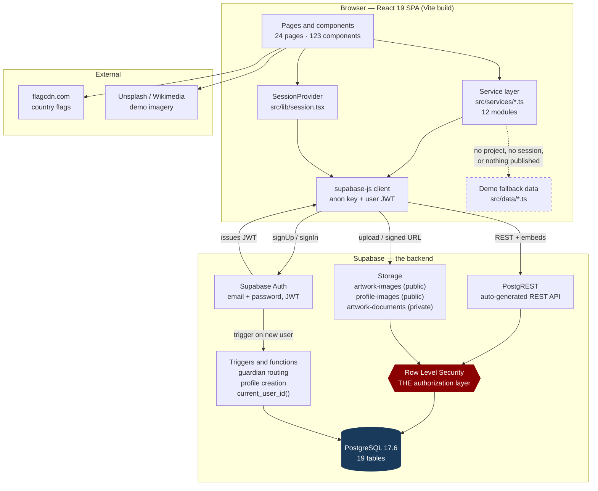
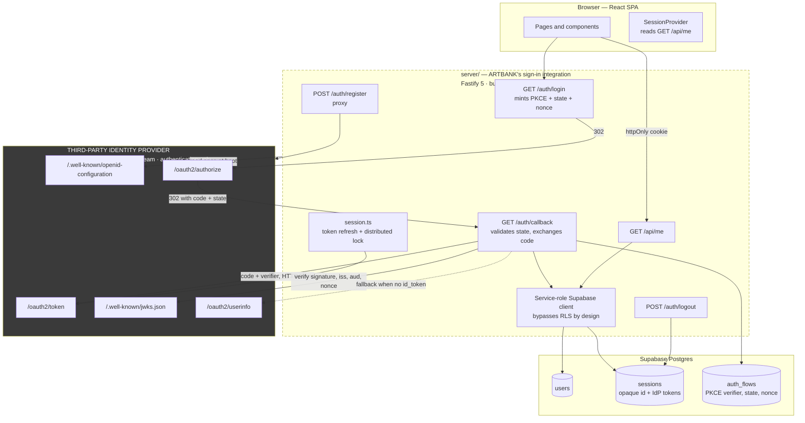
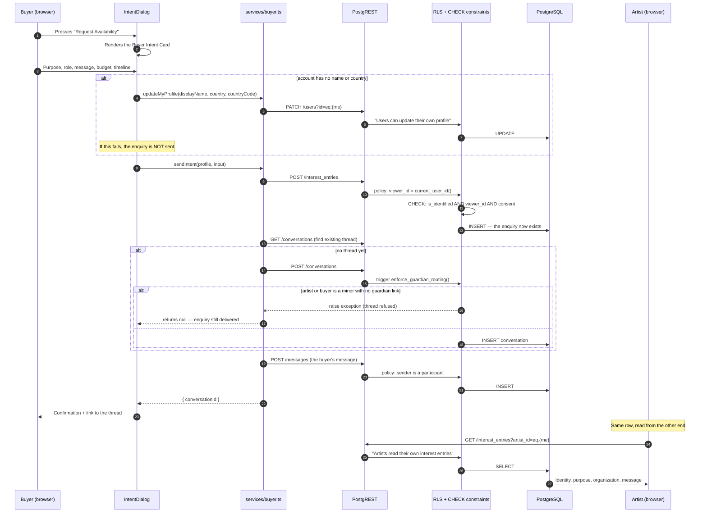
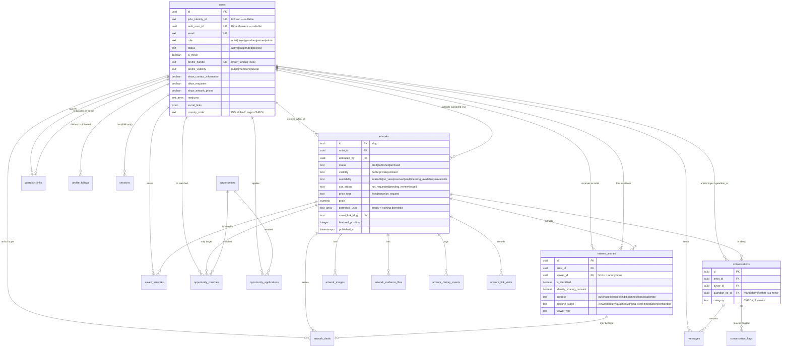

# ARTBANK — Project Documentation

**Document type:** Technical and non-technical project report, prepared as source material for a project presentation.
**Repository:** `e:\projects\ARTBANK` (branch `main`)
**Documentation date:** 27 August 2026
**Basis:** This document was written by reading the actual repository — source files, migrations, configuration and git history. Where something could not be confirmed from the code, it says so explicitly. Nothing here is aspirational.

---

## Table of Contents

1. [Project Overview](#1-project-overview)
2. [Problem Statement](#2-problem-statement)
3. [Proposed Solution](#3-proposed-solution)
4. [Key Features](#4-key-features)
5. [System Workflow](#5-system-workflow)
6. [Technology Stack](#6-technology-stack)
7. [System Architecture](#7-system-architecture)
8. [Database](#8-database)
9. [Backend / API](#9-backend--api)
10. [Frontend](#10-frontend)
11. [Security](#11-security)
12. [Challenges and Technical Decisions](#12-challenges-and-technical-decisions)
13. [Results / Current State](#13-results--current-state)
14. [Future Improvements](#14-future-improvements)
15. [Project Significance](#15-project-significance)
16. [Presentation Cheat Sheet](#16-presentation-cheat-sheet)
17. [Possible Questions From Evaluators](#17-possible-questions-from-evaluators)
18. [What I Need to Know Before Presenting](#what-i-need-to-know-before-presenting)

---

## Reading key used throughout this document

| Label | Meaning |
|---|---|
| **Implemented** | Fully built, wired to the database, works end to end. |
| **Partially implemented** | The screen is real, but part of what it shows is static demo data, or one half of the feature is missing. |
| **Schema only** | The database supports it (tables, constraints, policies) but no interface writes to it. |
| **Built, not connected** | The code exists and type-checks, but nothing in the running application calls it. |
| **Not built** | Named in the specification documents but absent from the codebase. |

---

## 1. Project Overview

### Project name

**ARTBANK** (package name `artbank`; browser title *"ARTBANK — The Global Creator Bank of Creative Value"*).

### One-sentence description

ARTBANK is a web platform that lets artists turn each artwork into a documented, evidence-backed professional record, publish a profile they control, and receive enquiries only from buyers who have identified themselves and stated what they want.

### Detailed description — what the system is intended to be

*This section describes ARTBANK as a finished system: the product it is designed to become. [Section 4](#4-key-features) labels which parts are built today, and [Section 13](#13-results--current-state) gives an honest account of the current state.*

ARTBANK is the professional infrastructure an artist's work needs in order to be taken seriously — documentation, provenance, rights, controlled visibility and identity-gated contact — supplied directly to the artist instead of through a gallery.

It is a web application organised as two private workspaces behind one public site:

- **ArtSpace** — the artist's workspace. An artist documents each artwork as a complete record: descriptive details, a gallery of images with declared roles, private evidence documents (ownership proofs, certificates, exhibition records, condition reports, appraisals), pricing and shipping terms, explicitly granted permitted uses, and a visibility setting. Each record accumulates an append-only history of everything that happens to it. From the same workspace the artist manages the whole portfolio, reads who has shown genuine interest in their work, reviews opportunities matched to their practice with an explanation of why each one matched, and holds structured conversations with buyers.

- **The buyer workspace** — the other side of the same data. Buyers discover published work, save pieces to a personal shelf, and file a **Buyer Intent Card** whenever they want price, availability, licensing terms or private access. That card is the only route to an artist: there is no anonymous enquiry and no back channel.

- **The public surface** — an Artists directory and a public profile per artist at their own handle, showing exactly what that artist chose to expose, with Contact and Follow as the two actions.

Three commitments define the system, and each is meant to hold structurally rather than by convention:

**1. Identity before access.** A visitor may look. Anyone who wants more than that must say who they are, what they want it for, and consent to that identity reaching the artist. Anonymous traffic is recorded as a bare count and never as a person — in the interface, in exports, and in the database itself, where an anonymous record carries no identity to leak.

**2. The artist decides what is visible.** Visibility, contact disclosure, price disclosure and permitted uses are separate, explicit, opt-in switches. A new record starts private with nothing permitted; the artist opens it up deliberately rather than discovering it was already open.

**3. The platform never invents a fact about an artist.** No automatic valuation, no popularity score, no ranking, no estimated earnings, no unexplained recommendation. Where a number cannot be established honestly, the system shows nothing rather than an approximation.

Alongside these, the system is designed to protect minor artists: an account belonging to a minor is linked to a verified guardian, and no external contact reaches that artist without the guardian being routed into it.

Authentication is **delegated to an external identity provider** — a separate, third-party system that ARTBANK connects to purely to sign users in. ARTBANK never handles a password and holds no credentials of its own; it keeps only its own profile record for each identity. See [Section 6.5](#65-apis-and-external-services).

### What the system does

*The intended capability set. Build status per feature is in [Section 4](#4-key-features).*

| Capability | Who uses it |
|---|---|
| Create an account and choose Artist or Buyer | Anyone |
| Document an artwork: details, images, provenance, pricing, shipping, evidence files, rights, visibility | Artist |
| Publish, unpublish, archive, delete and re-price artworks | Artist |
| Read a full record per artwork: overview, passport, interest, opportunities, rights, earnings, history | Artist |
| Edit a public profile and choose exactly what it exposes | Artist |
| See who has enquired, and how much anonymous traffic there was | Artist |
| Read and reply to structured conversations | Artist and Buyer |
| Browse published works, search, and save them | Buyer |
| File an identified enquiry with purpose, budget band, timeline and message | Buyer |
| Follow an artist and contact them from their public profile | Any signed-in user |
| Export portfolio and interest data to CSV | Artist |

### Intended users

1. **Artists** — particularly emerging and early-career artists who have work but no professional documentation around it. The seed data and the underlying brief are oriented toward the Malaysian and wider Southeast Asian art scene.
2. **Buyers, collectors, galleries and organizations** — people sourcing work who currently negotiate through social-media DMs with no reliable information about the piece or the artist.
3. **Guardians** — adults responsible for a minor artist's account, who approve external contact and engagements on that artist's behalf. *(Enforced in the database today; the interface is not yet built.)*
4. **Partners and organizations** — galleries, studios and institutions sourcing work or posting opportunities. *(Role modelled in the schema; no dedicated interface yet.)*
5. **Administrators** — reviewing evidence behind certificate requests and managing the platform. *(Role modelled in the schema; no dedicated interface yet.)*

### Main purpose

To move an artist's commercial life off social media into a system where:

- every artwork has a durable, evidence-backed record rather than a caption on a post;
- every serious enquiry arrives with a named person and a stated purpose attached;
- the artist controls visibility, pricing disclosure and permitted uses, field by field;
- a minor artist cannot be contacted without their guardian in the loop;
- nothing about the artist is invented, estimated or ranked by the platform.

The measure of success is not how much traffic the platform generates. It is whether an artist who has used it for a year has something a gallery, a curator or an insurer would accept as a professional record — and whether the enquiries they received in that year were worth their time.

---

## 2. Problem Statement

*Written to be understandable without any programming background.*

### The real-world problem

Most artists sell and get discovered through Instagram, WhatsApp and word of mouth. That works to a point, then fails in five specific ways.

**1. An artwork has no record — only a photograph.**
A post shows a picture and maybe a caption. It does not carry the medium, exact dimensions, year, whether the work is signed, whether it is an original or one of an edition, who has owned it, where it has been exhibited, or whether the artist holds the rights to license it. When a gallery asks, the artist reconstructs the answers from memory, old messages and phone photographs. Every time. For every enquiry.

**2. Enquiries are anonymous, and most are noise.**
A message saying "how much?" from an account with no name, no location and no stated purpose is indistinguishable from a serious approach by a curator. The artist cannot tell which of twenty messages deserves two hours of attention, so they either answer all of them badly or stop answering.

**3. The artist has no idea what is actually happening around their work.**
A post has likes and views. Neither tells the artist that a gallery in Singapore looked at four pieces last week, or which artwork is generating commercial interest rather than casual scrolling.

**4. Rights and ownership are undefined by default.**
When an artwork is posted publicly, nothing states what may be done with it. Can a hotel print it? Can a magazine reproduce it? Can someone commission a variation? On social media the answer is silence, which in practice means people assume.

**5. Young artists are exposed.**
A minor posting work publicly can be contacted directly by any adult, with no oversight.

### Why this matters

- **It costs artists money.** Serious approaches are lost inside noise, and undocumented work is harder to price and harder to sell.
- **It costs artists time.** Answering the same eight questions by hand, forever.
- **It costs buyers confidence.** A buyer with a real budget cannot verify anything about a work or the person selling it, so they buy from established galleries instead — which is exactly the gate emerging artists cannot get through.
- **It leaves artists without a professional history.** After five years of posting, an artist has a feed, not a portfolio: no provenance, no exhibition record, no evidence trail.

### Why existing approaches fall short

| Existing approach | Limitation |
|---|---|
| **Instagram / social media** | Built for attention, not transactions. No structured record, no identity on enquiries, no rights model, no privacy control beyond public/private. Popularity metrics reward volume, not quality. |
| **Traditional galleries** | Provide documentation and buyer vetting, but take a large commission, accept very few artists, and are geographically limited. |
| **General e-commerce (Etsy, Shopify, marketplaces)** | Model art as retail stock. No provenance, no rights or licensing model, no distinction between a serious identified enquiry and a browsing shopper. |
| **Online art marketplaces with rankings and auctions** | Introduce leaderboards, trending feeds and popularity scores. ARTBANK's own guardrail document (`docs/pivot-checklist/17-do-not-build-guardrails.md`) explicitly bans all three, on the grounds that they reward visibility rather than professionalism and disadvantage exactly the emerging artists the platform exists for. |
| **Spreadsheets / personal archives** | Some diligent artists do keep records. They are private, unshareable, unverifiable, and disconnected from any buyer. |

### The gap ARTBANK addresses

No widely available tool does all three of these at once: **document the work properly**, **control who sees what**, and **force an enquiry to carry an identity and a purpose**.

---

## 3. Proposed Solution

### The core idea

**Turn an artwork from a photograph into a record, and turn an enquiry from a message into a disclosure.**

Two mechanisms carry the whole product:

1. **The artwork record** — a structured, multi-part object per artwork: descriptive details, a gallery of images with declared roles (cover, front, back, side, detail, framed, in situ, signature), private evidence documents (ownership proof, certificates, exhibition records, condition reports, invoices, appraisals), pricing choices, shipping terms, explicitly ticked permitted uses, a visibility setting, and an append-only history of everything that has happened to the piece.

2. **The Buyer Intent Card** — the single doorway to anything beyond looking. Any buyer pressing *Request Availability*, *Contact Artist* or *Request Viewing Room* gets the same form: purpose, how they describe themselves, organization, budget band, intended use, decision timeline, and a message. Their name and country come from their own account. Submitting the form is the consent to be identified, and the database physically refuses to store an "identified" enquiry with no person attached.

### How users interact with it

**An artist:**
1. Signs up, choosing "Artist / Creator".
2. Lands in ArtSpace.
3. Presses *+ Add Artwork* and walks through five steps — Details, Images, Pricing & Availability, Documents, Review & Publish. Step 1 saves a private draft immediately; every later step writes against that draft.
4. Chooses visibility (Public, Private or Unlisted), confirms a rights statement, then presses Publish. Nothing publishes on its own.
5. Manages the portfolio in *My Works* — filter, search, sort, bulk-publish, archive, change availability, export to CSV.
6. Fills in a public profile, picks a handle, and chooses field by field what a stranger may see: contact information, whether enquiries are allowed, whether prices are shown.
7. Watches *Interest* for identified enquiries and *Messages* for conversations.

**A buyer:**
1. Signs up, choosing "Buyer / Organization".
2. Lands in *Discover* — every published, publicly-visible artwork, in the order the artists published them. No ranking.
3. Saves works to a personal shelf.
4. Opens an artwork and sees the specification table, the passport state and the artist card.
5. To get anything more, fills in the Buyer Intent Card. That single action writes an entry into the artist's Interest Ledger **and** opens a message thread with the buyer's message already in it.
6. Tracks everything in *My Enquiries*, where the status is derived from the artist's own pipeline stage plus whether the artist has actually replied.

### What makes the solution useful

- **The enquiry and the ledger entry are the same row.** The buyer's *My Enquiries* screen and the artist's *Interest* screen read the same database record from opposite ends. The two sides can never disagree about what was asked.
- **Nothing is invented.** No automatic valuation, no computed quality score, no estimated earnings. Recorded earnings come only from an explicitly recorded deal; if none exists the interface says *"No earnings"*, not *"0"* — because those are different claims.
- **Permission-first defaults.** A new artwork is `status: draft`, `visibility: private`, `permitted_uses: {}` (empty means *nothing* is permitted). The artist opens the record up deliberately, rather than discovering it was already open.
- **Anonymity is respected in both directions.** Anonymous traffic is counted, never named — not on screen, and not in the CSV export either.

### How it improves the current situation

| Before | After |
|---|---|
| "How much?" from an unnamed account | A named person, their role, their organization, their purpose, their budget band and their timeline |
| Details reconstructed from memory per enquiry | One record, reused for every enquiry, exported on demand |
| Rights undefined | An explicit list of permitted uses the artist ticked |
| Popularity metrics | No likes, no rankings, no trending — a chronological feed |
| A minor reachable by any adult | The database refuses to create a conversation involving a minor without a verified guardian attached |

---

## 4. Key Features

### 4.1 Core features

---

#### F1 — Account creation and sign-in
**Status: Implemented**

**What it does.** Creates an ARTBANK account with an email and password, asking one question at sign-up: *Artist / Creator* or *Buyer / Organization*.

**How the user interacts.** A single animated card at `/login` and `/register` with a sliding panel; the URL stays in step with whichever side is showing, so a refresh reopens the same form. Sign-up shows a "check your email to confirm" state when confirmation is required.

**Why it matters.** The role chosen here decides which of the two workspaces the account lands in for the rest of its life.

**Technical detail.**
- `src/services/auth.ts` wraps Supabase Auth (`signUp`, `signInWithPassword`, `signOut`, `resend`, `getSession`, `onAuthStateChange`).
- The chosen role travels as `user_metadata.role`.
- A Postgres trigger, `handle_new_auth_user` (migration `0009`), fires `after insert on auth.users` and creates the matching `public.users` profile row, defaulting to `buyer` if the metadata role is missing or is not one of the two offered.
- `emailRedirectTo` is set to `{origin}/login`, otherwise Supabase would send a confirmed user to the project's default Site URL (the marketing homepage).
- **Deliberately not collected at sign-up:** name and profile details. The intended identity provider is meant to own that data, and collecting it here would create a second source of truth to reconcile later.

---

#### F2 — Session, route guard and role-based landing
**Status: Implemented**

**What it does.** Holds the signed-in user for the whole application, gates every private route, and sends each account to the correct workspace.

**How the user interacts.** Invisible when it works. An unauthenticated visitor hitting `/artspace/works` is redirected to `/login?next=/artspace/works` and returned there after signing in.

**Technical detail.**
- `SessionProvider` (`src/lib/session.tsx`) exposes `{ loading, isAuthenticated, profile, configured, signOut, refresh }` through React context. Screens read this rather than calling Supabase for identity, so the identity source stays swappable.
- The provider and the `useSession` hook live in **separate files** (`session.tsx` / `sessionContext.ts`) because mixing a component and a hook in one module breaks React Fast Refresh.
- `RequireAuth` wraps the entire private route tree as one `<Outlet />` guard. It renders a "Checking your session…" state while `loading` is true — redirecting mid-check would bounce signed-in users on every refresh.
- `WorkspaceHome` at `/workspace` is a routing decision, not a page: it waits for the profile to load, then sends `role === 'buyer'` to `/collect` and everyone else to `/artspace`. It exists as a route rather than a branch in the sign-in handler because the role lives on the profile row, which has not loaded at the moment sign-in returns.
- The `next` parameter is validated (`startsWith('/')` and not `//`) so the query string cannot be used to bounce a user to another host — a deliberate open-redirect defence.
- **Log-out navigates first, signs out second.** Flipping `isAuthenticated` while still on a guarded URL lets `RequireAuth` win the race and redirect to `/login` before the intended navigation to `/` lands. Leaving the guarded route first removes the race.

---

#### F3 — Add Artwork: a five-step guided flow
**Status: Implemented**

**What it does.** Walks an artist through creating a complete artwork record. Five steps cover the specification's nine requirements.

| Step | Collects | Writes to |
|---|---|---|
| 1. Details | Title, year, medium, category, dimensions (structured numbers + display string), tags, materials, description, collection, artwork type (original / limited / open edition), edition size, creation location, date created, signed, COA promised, ownership confirmation | `artworks` (as a draft) + first `artwork_history_events` row |
| 2. Images | Up to 10 files, ≤20 MB each, JPG/PNG/WebP; per-image role; cover selection; reordering; deletion | `artwork-images` storage bucket + `artwork_images` |
| 3. Pricing & Availability | Price type (fixed / range / on request), currency, price, max price, compare-at price, availability, ships-from, ready-to-ship-in, shipping regions, international shipping, includes-COA, physical/digital, layaway | `artworks` |
| 4. Documents | Up to 12 files, ≤15 MB each, PDF/JPG/PNG/Word; document type from seven categories | `artwork-documents` (private bucket) + `artwork_evidence_files` + a history event |
| 5. Review & Publish | Permitted uses, rights note, visibility, rights confirmation | `artworks` + a `publish` history event |

**Why it matters.** This is the feature the whole product rests on, and where the "nothing is auto-populated" rule is enforced — every field is filled by something the artist typed or chose.

**Technical detail.**
- Step 1 saves a real draft and returns an id; every later step writes against that id, so a half-finished record survives.
- Validation lives in `src/components/artspace/artworkDraft.ts` as three pure functions (`validateDetails`, `validatePricing`, `validateReview`) plus `reviewChecklist`, so the Review screen and any future readiness scan compute completeness from one source rather than from markup.
- Numbers are held as strings while typing and converted once on save — a half-entered "20" is not coerced mid-keystroke.
- Defaults are permission-first: `status: 'draft'`, `visibility: 'private'`, `availability: 'unavailable'`, `permitted_uses: []`.
- Publishing requires an explicit tick of the rights statement; `validateReview` blocks it otherwise.
- Postgres error codes are translated into actionable messages (`42703` undefined column, `42P01` undefined table, `42501` RLS refusal, check-constraint violations) rather than shown as a generic "could not save".
- Validation catches errors the database would also catch — e.g. a compare-at price lower than the real price reads as a discount that does not exist, so the form refuses it before the round trip.

---

#### F4 — Artwork image management
**Status: Implemented**

**What it does.** Uploads image files to Supabase Storage, records one row per file, and lets the artist set the cover, label each image's role, reorder them and delete them.

**Technical detail (`src/services/artworkImages.ts`).**
- Files are validated client-side *before* upload (`rejectionReason`) so a rejection costs no bandwidth.
- Path scheme: `{artworkId}/{timestamp}-{position}.{ext}` in the **public** `artwork-images` bucket.
- The first image on a record automatically becomes the cover — a record with images but no cover has nothing to show on a card.
- If the database row fails to save after a successful upload, the orphaned file is removed from storage.
- Setting a new cover clears the previous one first, so exactly one image is ever primary.
- Reordering rewrites positions from the array index, keeping them contiguous.

---

#### F5 — Evidence documents with signed URLs
**Status: Implemented**

**What it does.** Attaches supporting evidence to an artwork — ownership proof, certificates of authenticity, exhibition records, condition reports, invoices, appraisals.

**Why it is technically distinct.** These are ownership proofs and invoices, not pictures of the work, so they go to a **private** storage bucket. Viewing one mints a signed URL valid for **300 seconds**, so a copied link does not become a permanent public one.

**Technical detail (`src/services/artworkDocuments.ts`, migration `0020`).**
- Bucket `artwork-documents` is created with `public: false`. The migration comment gives the reason: migration `0015` already declared these rows private via RLS, and *"a public bucket would make that policy decorative, since anyone with the URL could read the file."*
- Storage RLS scopes access by the first path segment: a file at `{artwork_id}/...` is reachable only by the account that owns that artwork.
- Each document type carries a `strengthens` line in the interface explaining what it does for a passport review, so the artist can tell which upload is worth the effort.
- Uploading a document also appends an `evidence` event to the artwork's history — best-effort, so a failed history write never loses the upload.

---

#### F6 — My Works: portfolio management
**Status: Implemented**

**What it does.** The artist's artwork management screen — deliberately a management table, not an image gallery. Every row carries status, availability, documentation state, identified interest count, opportunity count and recorded earnings.

**How the user interacts.** A tab strip with live counts; a filter panel (status / availability / passport / sort); a search box whose term is kept in the URL (`?q=`) so a search is shareable and survives refresh; a table/grid view toggle; pagination at 7 per page; per-row action menus; and multi-select bulk actions.

**Actions:** view, edit, share (copies link to clipboard), publish, unpublish, archive, restore, set availability, set visibility, delete, export CSV.

**Technical detail.**
- Every write is optimistic — the row updates first, then persists — so a menu click responds immediately. A failed write reverts the row and says what went wrong.
- Bulk actions run in parallel via `Promise.allSettled` and report a count rather than one toast per row; a partial failure is reported as a partial failure, so the number on screen is always the number that saved.
- **Delete is guarded.** `canDelete(work)` returns true only when a record has no identified interest, no opportunities and no recorded earnings. Anything else must be archived. The source comment is the reasoning: *"Deleting a work that has provenance destroys that provenance."*
- Delete collects storage paths for images and documents *before* the row cascade removes their rows, then removes the files afterwards — otherwise the files would be orphaned with nothing left to read their paths from. Storage removal is best-effort and happens after the row is gone, so a storage hiccup cannot resurrect an artwork the artist confirmed deleting.
- Sorting by earnings puts "nothing recorded" last rather than treating it as zero.
- Marking a work Sold explicitly says *"Recorded earnings only change when a transaction is recorded"* — the interface refuses to imply money it has not been told about.

---

#### F7 — The artwork record ("Living Creative Asset Passport")
**Status: Implemented**

**What it does.** One artwork, in full, across seven tabs: **Overview, Passport, Interest, Opportunities, Rights, Earnings, History**.

**Technical detail (`src/services/artworkRecord.ts`).**
- Assembled from eight parallel queries rather than one deep join: the tabs are independent, the sets are small, and a single failing relation would otherwise take the whole page down with it.
- Sources: `artworks`, `artwork_images`, `artwork_evidence_files`, `interest_entries` (+ the viewer's user row), `artwork_deals` (+ the buyer's user row), `opportunity_matches` (+ `opportunities`), `artwork_history_events`, `artwork_link_visits`.
- The Interest tab enforces the hard rule in code as well as in the schema: anonymous rows are counted and never listed.
- With a database configured, a missing id is an honest 404 rather than a silent substitution with demo data — *"showing someone else's demo artwork under the URL they asked for would be worse than an honest empty state."*

---

#### F8 — Public profile editor
**Status: Implemented**

**What it does.** The artist's single profile editor, with four tabs. Every field maps to a real database column and every control saves.

**Fields:** display name, artist name (an artist may exhibit under a name that is not on their account), nationality, country (chosen from a real ISO list, which is what makes the flag possible), website, public email, short bio, artist statement, mediums, years active, education, awards, social links, avatar and cover images, profile handle, and the visibility switches.

**Visibility switches:** profile visibility (public / members / private), show contact information (default **off**), allow enquiries (default **on** — reaching the artist is the point of the platform), show artwork prices (default **off**).

**Technical detail.**
- Saving is owned by the page rather than by each card, so the Profile Settings tab and the sidebar's Visibility panel always show the same thing.
- `public_email` is a separate column from `email`. The account address is never displayed, and the migration carries a comment saying exactly that.
- Featured artworks are ordered by `featured_position` (an integer, not a boolean) so the artist controls the order; only **published** works can be featured, so featuring cannot publish a draft by the back door.
- Setting the featured list clears every existing position in one pass, then writes new positions from the array index — no stale positions left behind.
- The handle has a case-insensitive unique index (`lower(profile_handle)`) and is nullable, so an account without one is simply not reachable by a public URL yet.

---

#### F9 — Public artist profile, Follow and Contact
**Status: Implemented**

**What it does.** A public page at `/artists/{handle}` showing the artist's presentation fields, featured works, credentials and follower count, with two actions.

**Order of actions is a specification requirement:** Contact first, Follow second, social links third — reversing a design in which social icons dominated.

**Technical detail.**
- `getPublicProfile(handle)` returns null both when no such handle exists and when the profile is not public. The two are indistinguishable from outside on purpose.
- Following is an identified act: `profile_follows` has a composite primary key of (follower, artist), a `follower_id <> artist_id` constraint, and RLS letting a user manage only their own follows while the artist may **read but not delete** their follower list — only the follower can unfollow.
- Contact writes an `interest_entries` row with `is_identified: true`, `identity_sharing_consent: true` and `source: 'profile'`.
- The page shows **no** earnings, interest counts, readiness score or ranking. The only figures are the size of the public body of work and the follower count.
- The Artists directory (`/artists`) lists real public artists alphabetically — *not* by follower count, because the guardrail document bans a public artist ranking and ordering by a popularity number would read as exactly that.

---

#### F10 — Interest Ledger
**Status: Partially implemented**

**What it does.** Shows the artist who has shown genuine interest in their work.

**What is real:** the identified enquiries list and the anonymous visitor **count**, both read from `interest_entries` filtered by `artist_id`. CSV export is real.

**What is still demo data:** the Followers panel and the Recent Viewers list (that panel needs thumbnails the ledger table does not carry, and the source says so). The right-hand statistics panels are static.

**The hard rule, enforced three times over:**
1. **Schema.** A `CHECK` constraint refuses any row that is `is_identified = true` without a `viewer_id` and consent, and refuses any row that is `is_identified = false` *with* a `viewer_id`. An anonymous row therefore has no identity to leak.
2. **Query.** The ledger read filters `is_identified = true`; the anonymous count is a separate `head: true` count query that returns a number and no rows.
3. **Export.** `exportInterestCsv` includes identified people only, and reports how many were exported alongside the sentence *"Anonymous visitors are never included."*

---

#### F11 — Opportunities
**Status: Partially implemented**

**What it does.** Shows opportunities matched to the artist, each with a strength band, a score, an explanation of *why* it matched, and a list of what is still missing before they can apply.

**What is real:** reading `opportunity_matches` joined to `opportunities`, cross-referencing `opportunity_applications` for the artist's stage, deriving the stage label, and tab filtering.

**What must be stated honestly:** **there is no matching algorithm.** `opportunity_matches` rows exist only because seed migration `0016` inserted them. There is no application code path and no RLS insert policy that creates a match, so matching today is data, not computation.

**Two design rules visible in the schema:**
- `why_text` is `NOT NULL` — the brief forbids unexplained recommendations, so a match that cannot say why it matched cannot exist as a row.
- A `CHECK` constraint on `opportunity_applications` refuses `status = 'submitted'` unless both `approved_by` and `submitted_at` are set. Nothing can auto-submit on an artist's behalf, not even an accidental bulk `UPDATE`.
- A weak match is surfaced honestly as *"Not a Fit"* rather than padded into looking like a live prospect.

---

#### F12 — Messages
**Status: Implemented (with one gap)**

**What it does.** Structured professional conversations rather than freeform DMs. Every conversation carries its category, the artwork it is about, and the purpose. Both workspaces have a mailbox; both can send.

**Technical detail (`src/services/messages.ts`).**
- One mapper serves both sides. A `side` parameter picks which column identifies "me" (`artist_id` or `buyer_id`) and which embedded user is "them" (via an explicit foreign-key hint, because `conversations` points at `users` twice and PostgREST refuses an ambiguous embed). This is why the artist's and buyer's mailboxes cannot drift apart.
- Threads are grouped by calendar day for the date rules in the interface.
- Only organization and country ever reach the interface as a descriptor. Personal email and phone are never surfaced in a thread, so contact stays inside ARTBANK.
- The notification bell's badge and dropdown come from one query over `conversations` + `messages`, counting messages the other party sent that carry no `read_at`. Interest and opportunities are deliberately *not* folded into that count, because the schema gives them no read state and approximating it by recency would be a fabricated number.

**The gap:** nothing in the application ever *writes* `read_at`. Unread counts are computed correctly but never clear. This is a genuine, verifiable limitation.

---

#### F13 — Buyer Discover feed and save list
**Status: Implemented**

**What it does.** Shows every published, publicly-visible artwork, newest published first, with client-side search across title, artist, medium and dimensions, and a save toggle on every card.

**Design rule stated in the source:** there is no ranking, no "trending" and no popularity sort — *"a feed ordered by likes would be the same leaderboard under another name."*

**Technical detail.**
- `unlisted` records are excluded here on purpose. They remain *readable* (that is what makes a share link work) but being absent from every listing is the entire point of the setting, so the filter belongs in the query rather than in the read policy.
- Saving is optimistic and reverted on failure — the right trade for a button pressed constantly while browsing; getting it wrong costs a single row the next page load corrects.
- The save list is read as a separate query rather than joined onto the feed, because `saved_artworks` is readable only by its owner; embedding it would make the whole Discover query depend on being signed in.
- On Saved Works, an empty list is treated as a **real answer** and never falls back to the demo shelf — otherwise nothing a buyer removed would ever look removed.
- A saved work whose artist has since unpublished it comes back as `null` from the embed; the row is filtered out rather than rendered as a blank card.

---

#### F14 — Buyer artwork page and the Buyer Intent Card
**Status: Implemented**

**What it does.** One artwork as a buyer sees it, with three actions — *Request Availability*, *Contact Artist*, *Request Viewing Room* — all three opening the same Buyer Intent Card.

**Why all three are the same form.** The specification requires identity and stated intent before *any* of price, availability, licensing or private access. Saving a work is the only thing a buyer can do here without telling the artist anything.

**What the card collects.** Purpose (required), role/self-description (required), message (required), organization (conditional), budget band (optional, banded rather than a free number *"to tell the artist whether a conversation is worth having, not to open a negotiation before anyone has spoken"*), intended use (required when the purpose is licensing), decision timeline (optional). Name and country come from the buyer's own account; if the account has neither, the form collects them and saves them to the profile **before** sending, because an artist receiving a card with no name on it is the one outcome the form exists to prevent.

**Technical detail (`sendIntent` in `src/services/buyer.ts`).**
- Two writes, in a deliberate order. The `interest_entries` row goes first, because it is the record that matters — the artist's ledger reads it. The conversation thread is the convenience on top. A failure opening the thread therefore still leaves a delivered enquiry rather than nothing.
- `is_identified` and `identity_sharing_consent` are hard-coded `true`. Not a shortcut: the `CHECK` constraint would refuse any other value on a row with a viewer attached, and submitting the form *is* the consent — the dialog says so above the button.
- The purpose vocabulary (`interest_entries.purpose`) and the conversation vocabulary (`conversations.category`) are deliberately different lists, both fixed by `CHECK` constraints, so the mapping between them is an explicit lookup table rather than a cast.
- Thread lookup handles a nullable `artwork_id` correctly: `.eq(col, null)` does not match nulls in SQL, so a general enquiry uses `.is('artwork_id', null)` — without which a second thread would open every time.
- A forward-compatibility retry: if the `viewer_role` column does not exist yet (a database still on migration `0022`), the insert is retried without it rather than losing a serious enquiry over a field the artist would like but does not need.
- `openConversation` returns `null` rather than throwing when a thread cannot be opened. The one case that reliably does this is the guardian-routing trigger refusing a conversation involving a minor — by design, and no buyer-side form can or should supply a guardian.
- **Price display requires two independent permissions to both say yes:** the artist's profile switch (`users.show_artwork_prices`) *and* the record's own `price_type`. "Price on request" is what the artist chose, not a value the app failed to load.
- **What is deliberately absent from the artist card:** response rate and average response time. Both would have to be computed from other people's message threads, which RLS rightly refuses to hand over. "Member since" and the size of the public body of work are real numbers and are shown.

---

#### F15 — My Enquiries and Viewing Room requests
**Status: Implemented (Viewing Rooms: buyer side only)**

**My Enquiries** shows the buyer their filed enquiries with a derived status: *Awaiting Response*, *In Conversation*, *Viewing Room* or *Closed*. Status is **derived, never stored twice** — it reads the artist's own `pipeline_stage`, so the two sides cannot drift. "In Conversation" is the one case the stage cannot answer alone; it means the artist has actually replied, which only the message thread knows.

**Viewing Rooms** lists what the buyer has requested. Every entry says *"Requested"*, never *"Open"*, because creating and curating a room is the artist's half of the feature and **is not built**. The screen does not claim a room exists.

---

### 4.2 Supporting features

| Feature | Status | Notes |
|---|---|---|
| **Demo-data fallback contract** | Implemented | Every read service returns `{ data, isDemo }`. With no Supabase project, no session, or nothing published, screens render a labelled sample set rather than an empty page, and display an explicit "Sample works…" notice. This satisfies the specification's *"every sample is clearly labelled Demo"* requirement. Writes never fall back — they throw, since quietly "succeeding" at an enquiry nobody receives is the one failure this product cannot afford. |
| **CSV export** | Implemented | `src/lib/exportCsv.ts` — quotes cells, doubles internal quotes, writes a UTF-8 BOM so Excel reads accented names and the `×` in dimensions correctly. Two exporters: My Works and the Interest ledger. Pure browser code, no backend involved. |
| **Icon system** | Implemented | 87 hand-drawn 24×24 stroke SVG icons in one file behind a closed `IconName` union. No icon library dependency. |
| **Country picker and flags** | Implemented | `src/data/countries.ts`; migration `0022` stores a lowercase ISO 3166-1 alpha-2 code with a regex `CHECK`, matching flagcdn.com's URL convention with no case conversion at render time. Free-text values from before the picker keep `country_code` null and simply show no flag. |
| **Migration-tier fallback reads** | Implemented | `fetchProfileRow` tries three column sets in order (post-`0022`, post-`0021`, pre-`0021`), falling back on error. Without this, running the current build against a database one migration behind would fail every profile read and lock the user out of their own signed-in session. |
| **Human-readable database errors** | Implemented | `describeProfileError` / `describeSaveError` map Postgres and PostgREST codes to sentences: `23505` → "That profile URL is already taken", `42501` → "The database refused the change for this account", `42703`/`42P01` → "Run the outstanding migrations in supabase/migrations". |
| **Optimistic UI with revert** | Implemented | Used consistently for saves, status changes, availability, visibility, saves and deletes. |
| **Design token system** | Implemented | All colour, type, spacing, radius and shadow values are CSS custom properties on `:root` in `src/styles/globals.css`. |
| **Legal pages** | Implemented | Terms, Privacy and Cookies at `/terms`, `/privacy`, `/cookies`, written to match the actual product rather than generic boilerplate. **They are template copy, not attorney-drafted**, and the source file says so in a header comment. |
| **Zero dead routes** | Implemented | Unbuilt sections render a `ComingSoonPage`; `*` catches everything else. Old paths (`/creators`, `/membership`, `/apply`) redirect rather than 404. This directly satisfies specification item 13, *"Seven main routes return 404 → zero visible 404 pages."* |

### 4.3 Backend / administrative features

| Feature | Status | Notes |
|---|---|---|
| **Row Level Security as the authorization layer** | Implemented | 30+ policies across 12 tables and 3 storage buckets. Detailed in [Section 11](#11-security). |
| **`current_user_id()` helper** | Implemented | A `security definer` SQL function returning `public.users.id` for the current Supabase auth user. `auth.uid()` is the *auth* id, not the profile id; the two are joined by `users.auth_user_id`, and every policy needs that hop, so it lives in one place rather than being repeated as a subquery. |
| **Guardian routing trigger** | Implemented (schema level) | `enforce_guardian_routing` on `conversations` refuses to create a conversation involving a minor unless `guardian_cc_id` is set **and** that account is a verified linked guardian of that specific minor. A `CHECK` constraint cannot run those subqueries, so it is a trigger — which also means the rule holds for anything writing to the table, not only ARTBANK's own interface. **No UI exists to set `is_minor` or create a guardian link.** |
| **Auto-profile trigger** | Implemented | `handle_new_auth_user` creates the `public.users` row on Supabase Auth signup, honouring the chosen role. |
| **`claim_seed_artist(email)`** | Implemented | An administrative `security definer` function that re-points the entire seeded demo library at a real signed-up account and promotes it to `artist`. This is how the project is demonstrated with realistic data. |
| **Seed migration `0016`** | Implemented | 21 users, 7 artworks, 43 identified interest entries, 7 recorded deals, 4 opportunities with explained matches, 7 conversations. Fixed UUIDs, so re-running updates rather than duplicating. |
| **`run-pending.sql`** | Implemented | A generated concatenation of migrations `0017`–`0023` for pasting into the Supabase SQL editor, since the project is administered through the dashboard rather than a CI migration runner. |
| **Sign-in integration with the external identity provider** | **Built, not connected** | See F16 below. |

---

#### F16 — Sign-in integration with the external identity provider
**Status: Built, not connected — the single most important thing to be honest about**

**First, the boundary.** ARTBANK does not run its own identity system in the intended design. Sign-in is delegated to a **third-party identity provider (JO1N ID)** — a separate product, built and operated by a different team, which ARTBANK connects to **for authentication only**. It is not a component of ARTBANK, not a dependency ARTBANK ships, and not part of this project's deliverable. It happens to be present in the working directory as reference material while the integration was written; it is git-ignored and tracked in its own repository.

**What this project actually built** is the *connection* to that provider: `server/`, a Fastify 5 backend-for-frontend of 766 lines implementing the OpenID Connect Authorization Code flow with PKCE. That integration code is this project's work. The provider on the other end of it is not.

The relationship, stated plainly:

| | ARTBANK (this project) | The identity provider (third party) |
|---|---|---|
| Owns user credentials | No — never sees a password | Yes |
| Handles email verification, password reset, MFA | No | Yes |
| Stores a profile per user | Yes — `public.users` | Not ARTBANK's concern |
| Owns artworks, enquiries, messages, everything else | Yes | No involvement |
| Built by | This project | A different team |

The only link between the two systems is one column: `users.jo1n_identity_id`, holding the provider's subject claim. Everything else in the schema is ARTBANK's.

**What the integration implements:**

| File | Responsibility |
|---|---|
| `config.ts` | Environment configuration that fails fast at boot rather than at the first login attempt |
| `discovery.ts` | Reads the provider's `/.well-known/openid-configuration` once at boot, with a transport-security guard |
| `oidc.ts` | PKCE (S256), authorize-URL construction, token exchange, refresh, ID-token verification via JWKS, userinfo fallback, registration proxy |
| `db.ts` | Service-role Supabase client; user upsert, session creation, the refresh claim/lock, auth-flow storage |
| `session.ts` | Returns a valid access token, refreshing when needed, behind a distributed lock |
| `index.ts` | Six routes: `GET /health`, `GET /auth/login`, `GET /auth/callback`, `POST /auth/register`, `GET /api/me`, `POST /auth/logout` |

**Notable security work in it:**
- **PKCE + `state` + `nonce`**, all minted server-side and parked in an `auth_flows` table. Consuming a flow *is* the state validation — a `DELETE … RETURNING` means an unknown, expired or already-used value returns nothing, which blocks CSRF and replay with the same mechanism.
- **Transport enforcement in `discovery.ts`.** The token endpoint is authenticated with HTTP Basic, so an `http://` URL there would put the client secret on the wire in the clear. If the issuer is HTTPS and a discovered endpoint is HTTP on the *same* host, it is upgraded with a warning; a different host over HTTP is refused outright, because that is indistinguishable from being redirected somewhere hostile. The file's comment notes this is a *live* hazard with the current provider, not a hypothetical one.
- **Audience checking on the ID token.** Skipping it would let a token minted for another application in the same ecosystem log someone into ARTBANK.
- **Refresh-token rotation handling.** The provider rotates refresh tokens and treats reuse of a consumed one as an attack, revoking the whole token family. Two concurrent refreshes would therefore log the user out through no fault of their own. `claimRefresh` uses a conditional `UPDATE … WHERE refreshing_at IS NULL OR refreshing_at < :stale` as a lock — Postgres settles the race — and only the winner calls the provider. Losers poll for the result. A failed refresh revokes the session rather than leaving a husk that fails on every subsequent call.
- **Opaque session cookies.** The browser holds only a random 32-byte session id in an `httpOnly` cookie; the provider's access and refresh tokens stay in the `sessions` table and never reach client-side JavaScript. A second, non-sensitive, JS-readable "there is probably a session" hint cookie lets the SPA decide something synchronously before calling `/api/me`.
- **Identity matching on `sub`, never on email.** Email is changeable at the provider, and matching on it would let a re-registered address inherit someone else's account.
- **Registration proxy returns the provider's deliberately vague message**, so it cannot reveal whether an email is already taken.

**Why it is not connected.** The provider is not live yet, so the application signs users in with Supabase Auth as an interim path. `src/lib/session.tsx` is the one file that changes when the switch happens, and it carries a comment saying so. A repository-wide search confirms **nothing under `src/` calls `/api/me`, `/auth/login`, `/auth/logout` or `/auth/register`.** The Vite dev server is already configured to proxy `/api` and `/auth` to port 8787 for when it does — same-origin in development, so the session cookie stays first-party and no CORS or `SameSite=None` concessions are needed.

**What this means for the rest of the system.** Nothing. Authentication is a swappable edge: which provider signs a user in changes one column and one file. Every other feature in this document — records, evidence, rights, the interest ledger, messaging, the buyer workspace — is independent of that choice and works identically either way.

---

### 4.4 Explicitly not built (and why)

Named here so nothing in this report overstates the build.

| Item | State | Reason from the source |
|---|---|---|
| Smart Artwork Link / QR code | Partially implemented | `SmartLinkPanel` shows the record's own URL, which works for the signed-in artist. The public `/a/{slug}` page, the QR code and the social preview card are absent — a QR needs an encoder this project has no dependency for, and a preview card needs server-rendered meta tags a client-only SPA cannot produce. The panel states this limit on screen rather than letting it be discovered by sending the link to a gallery. |
| Artist-side Private Viewing Room | Not built | Buyers can request one; artists cannot open one. |
| Artwork Readiness Scan | Not built as a live feature | The checklist logic exists in `reviewChecklist()`; the ArtSpace readiness panels display static demo values. |
| Professional Artwork Pack | Not built | — |
| Artwork Action Plan | Not built | — |
| Guardian interface | Schema only | Enforcement exists in the database; no screen sets `is_minor` or creates a `guardian_links` row. |
| Recording a deal / earnings entry | Schema only | `artwork_deals` is read in three places; nothing writes to it. Earnings shown come from seed data. |
| Link-visit tracking | Schema only | `artwork_link_visits` is read; nothing writes a visit. |
| Report / Block / Archive a conversation | Schema only | `conversation_flags` exists with policies; the Messages archive tab returns an empty list, and the source comment says so. |
| Marking a message read | Not built | `messages.read_at` is read but never written. |
| Billing, Privacy settings, Security settings, Help Centre | Not built | Routed to `ComingSoonPage`. |
| Marketplace page | Legacy, hidden | Still routable at `/marketplace` but removed from navigation and reading a deliberately neutered query (price null, no likes) after the pivot. |
| MRI Rankings, likes, auctions, valuation, social feed, tokenization, course marketplace | **Deliberately removed / banned** | `docs/pivot-checklist/17-do-not-build-guardrails.md`. The MRI Rankings page was built earlier in this project's history and deleted in commit `e4a87e7`. |

---

## 5. System Workflow

There are two user roles with working journeys (Artist and Buyer), plus a public visitor. Guardian, Partner and Admin exist in the data model but have no interface.

### 5.1 Public visitor

1. Lands on `/` — the marketing homepage (hero, value pillars, discipline browser, featured artist, ArtSpace overview, buyer sourcing, market intelligence, daily brief, join band).
2. May browse `/artists` (the directory), any public artist profile at `/artists/{handle}`, and the legal pages.
3. Any private route redirects to `/login?next=…`.
4. Pressing **Contact** or **Follow** on a public profile requires signing in first — there is deliberately no anonymous follow and no anonymous enquiry.

### 5.2 Artist journey (end to end)

```
1.  Visitor presses "Enter ArtSpace" or "Create JO1NID" in the header.
2.  /register — enters email + password, selects "Artist / Creator".
3.  Browser calls Supabase Auth signUp with { role: 'artist' } in user_metadata.
4.  Postgres trigger on_auth_user_created fires:
        handle_new_auth_user() inserts a public.users row
        (auth_user_id, email, role = 'artist').
5.  Supabase sends a confirmation email; the screen says "check your email".
6.  Artist confirms, returns to /login, signs in.
7.  AuthPage navigates to /workspace.
8.  WorkspaceHome waits for the profile, reads users.role = 'artist',
        redirects to /artspace.
9.  ArtSpace "Today" renders (see the honesty note below).
10. Artist presses "+ Add Artwork".

    STEP 1 — Details
      validateDetails() runs client-side.
      createArtworkDraft() inserts into public.artworks with
        status='draft', visibility='private', availability='unavailable',
        a generated slug id, and artist_id = the artist's users.id.
      RLS policy "Artists manage their own artworks" permits the insert
        because artist_id = current_user_id().
      An 'upload' row is appended to artwork_history_events.
      The new id is held in React state for every later step.

    STEP 2 — Images
      Each file is validated locally, uploaded to the public
        'artwork-images' bucket at {artworkId}/{ts}-{position}.{ext},
        then a public URL is minted and an artwork_images row inserted.
      First image becomes is_primary + role='cover'.
      A failed row insert removes the uploaded file.

    STEP 3 — Pricing and availability
      validatePricing() runs; updateArtworkPricing() updates public.artworks.
      Database CHECK constraints independently enforce:
        a fixed price needs a number, a range needs both ends with max >= min,
        and no price may be zero or negative.

    STEP 4 — Documents
      Files go to the PRIVATE 'artwork-documents' bucket at {artworkId}/...
      A row lands in artwork_evidence_files with its document_type.
      An 'evidence' row is appended to the history.

    STEP 5 — Review and publish
      reviewChecklist() shows what is still incomplete.
      The artist ticks permitted uses, writes a rights note, chooses
        visibility, and must tick the rights confirmation.
      publishArtwork() sets permitted_uses, rights_note, visibility,
        status='published', published_at=now().
      A 'publish' row is appended to the history.

11. My Works now lists the record with real counts.
12. Public Profile: the artist fills in presentation fields, uploads an
      avatar and cover, chooses a handle, sets profile_visibility='public',
      and picks featured artworks.
13. /artists/{handle} is now live and readable by anyone, because the
      "Anyone can read public profiles" RLS policy matches.
14. When a buyer files an enquiry, it appears in Interest and Messages.
15. The artist replies in Messages; sendMessage() inserts into public.messages,
      permitted only because the RLS policy confirms the sender is a
      participant in that conversation.
```

**Honesty note on step 9:** the ArtSpace "Today" dashboard (Needs Your Decision, Real Interest, Artworks at Work, Best Opportunity, Money & Rights, Professional Readiness, Readiness Score) renders **static demo content**. Those six panels import from `src/data/artspaceContent.ts` and make no database call. Everything from step 10 onward is real.

### 5.3 Buyer journey (end to end)

```
1.  /register — email + password, selects "Buyer / Organization".
2.  Same trigger creates a public.users row with role='buyer'.
3.  Sign in → /workspace → WorkspaceHome reads role='buyer' → /collect.
4.  Discover queries public.artworks where status='published'
      AND visibility='public', ordered by published_at desc, limit 24,
      embedding artwork_images and the artist's public users row.
      A separate query reads this buyer's saved_artworks ids.
5.  Buyer searches (client-side) and saves works:
      optimistic UI update, then upsert/delete on saved_artworks.
6.  Buyer opens an artwork → /collect/artworks/{id}
      Detail query adds description, edition, materials, rights and
      permitted uses. countPublishedWorks() gives the artist's body of work.
      Price appears only if the artist's show_artwork_prices is true AND
      the record's price_type is not 'on_request'.
7.  Buyer presses Request Availability / Contact Artist / Request Viewing Room.
      All three open the Buyer Intent Card.
8.  If the account has no display_name or country, those are collected and
      saved to public.users FIRST. If that save fails, the enquiry is not sent.
9.  sendIntent():
      a) INSERT into interest_entries — artist_id, artwork_id, viewer_id,
         is_identified=true, identity_sharing_consent=true, purpose, message,
         organization, budget_range, intended_use, decision_timeline,
         viewer_role, pipeline_stage ('enquiry' or 'viewing_room'), source.
         The CHECK constraint validates the identity triple.
         RLS "Viewers create their own interest entries" permits it because
         viewer_id = current_user_id().
      b) openConversation() — finds or creates a conversations row for this
         (buyer, artist, artwork), then inserts the buyer's message and
         bumps last_message_at.
         If the artist is a minor with no guardian link, the guardian trigger
         REFUSES the conversation. The enquiry is already recorded, so the
         function returns null instead of throwing.
10. The screen confirms, and links to the thread when one was opened.
11. My Enquiries shows the enquiry with a derived status.
12. The artist sees the same row in Interest, and the thread in Messages.
```

### 5.4 The two sides meeting — the key insight

```
                 ONE ROW, READ FROM TWO ENDS

  Buyer files the Intent Card
             │
             ▼
   ┌────────────────────────┐
   │  interest_entries      │──────────────┐
   │  (one row)             │              │
   └────────────────────────┘              │
       │                                   │
       │ filtered by viewer_id             │ filtered by artist_id
       ▼                                   ▼
   /collect/enquiries                  /artspace/interest
   "My Enquiries"                      "Interest Ledger"
   status derived from                 shows the buyer's identity,
   pipeline_stage + whether            purpose, organization and message
   the artist replied
```

Because both screens read the same row, there is no synchronisation step, no duplicated status column, and no possibility of the buyer and artist disagreeing about what was asked.

---

## 6. Technology Stack

### 6.1 Frontend

| Technology | Version | Why it is used here |
|---|---|---|
| **React** | 19.2 | The application is a dense, state-heavy dashboard — a five-step wizard, optimistic tables, dialogs, two workspace shells. A component model with hooks is the right fit, and React 19's stable concurrent behaviour and improved `StrictMode` double-invocation surfaced several effect-cleanup bugs during development. |
| **TypeScript** | ~6.0 | The database has 19 tables and dozens of `CHECK`-constrained string vocabularies (`status`, `availability`, `visibility`, `price_type`, `purpose`, `pipeline_stage`). Modelling those as string-literal union types means an invalid value is a compile error rather than a runtime constraint violation. `strict`, `noUnusedLocals`, `noUnusedParameters` and `noFallthroughCasesInSwitch` are all on. |
| **Vite** | 8.2 | Instant dev server start and hot module replacement across ~370 source files. Its dev proxy is also what makes the BFF same-origin in development, so the session cookie stays first-party. |
| **React Router DOM** | 7.18 | Declarative routing with a `BrowserRouter`. The nested-route + `<Outlet />` pattern lets one `RequireAuth` guard cover the entire private tree — 21 routes — instead of repeating a check per page. |
| **CSS Modules** | native to Vite | 132 co-located `.module.css` files. Chosen over a utility framework for the bulk of the application because the design is a bespoke editorial system with its own token set; class names are locally scoped, so no global class collisions across 123 components. |
| **Tailwind CSS** | 4.3 (via `@tailwindcss/vite`) | **Scoped to the authentication screens only.** Those screens are a verbatim port of a supplied design bundle that was authored in Tailwind. Preflight is deliberately omitted from `src/styles/tailwind.css`, because Preflight is a global element reset that would override `globals.css` and restyle every other component in the application. |
| **clsx + tailwind-merge** | 2.1 / 3.6 | The `cn()` helper in `src/lib/utils.ts` — merges conditional classes and de-duplicates conflicting Tailwind utilities. Required by the shadcn conventions the auth bundle follows. |
| **Custom SVG icon set** | — | `src/components/ui/Icon.tsx`: 87 hand-drawn 24×24 stroke icons behind a closed union type. Avoids an icon-library dependency and keeps every glyph on-brand and stroke-consistent. |

### 6.2 Backend

There are **two** backends. Only one is live.

| Technology | Version | Status | Why |
|---|---|---|---|
| **Supabase** (Postgres + PostgREST + Auth + Storage) | `@supabase/supabase-js` 2.112 | **Live** | Supabase is the backend. The browser talks to PostgREST directly using the anon key plus the signed-in user's JWT; there is no application server in this path. This is a deliberate trade: it removes an entire tier to build and deploy, at the cost of pushing *all* authorization into Row Level Security. For a prototype with a hard deadline, that was the right call — and it forces the security model to live in the database, where it cannot be bypassed by a different client. |
| **Fastify** | 5.11 | **Built, not connected** | The BFF in `server/`. Chosen for its schema-first request typing and low overhead. |
| **`@fastify/cookie`** | 11.1 | Built, not connected | Opaque `httpOnly` session cookie handling. |
| **`jose`** | 6.2 | Built, not connected | JWT verification against a remote JWKS, with key caching and rotation handled internally. Used to verify the identity provider's ID tokens (issuer, audience, signature) before trusting a single claim. |
| **Node.js `crypto`** | built-in | Built, not connected | PKCE verifier/challenge generation and cryptographically random session ids — no third-party randomness dependency. |
| **`tsx`** | 4.23 | Dev tool | Runs the TypeScript server directly with watch mode (`npm run dev:server`). |

### 6.3 Database

| Technology | Why |
|---|---|
| **PostgreSQL 17.6** (hosted by Supabase) | Chosen for the features the security model actually depends on: **Row Level Security** (the entire authorization layer), `CHECK` constraints (the business rules that cannot be bypassed), triggers (guardian routing, profile creation, `updated_at`), array columns (`text[]` for tags, materials, mediums, permitted uses, shipping regions), and `jsonb` (social links). None of those exist in a document database, and the schema leans on all of them. |
| **PostgREST** (Supabase's auto-generated REST API) | Turns the schema into a REST API with no endpoint code to write, including relational embedding (`artwork_images(url, is_primary)`) and aggregate counts (`{ count: 'exact', head: true }`). |
| **Supabase Storage** | Three buckets: `artwork-images` (public), `profile-images` (public), `artwork-documents` (**private**, signed URLs only). |
| **SQL migrations, hand-written** | 23 files in `supabase/migrations/`, every one written to be safely re-runnable (`if not exists`, `drop policy if exists`, idempotent seed `on conflict`). Each carries a header comment explaining *why* it exists. |

### 6.4 Authentication and security

| Technology | Status | Why |
|---|---|---|
| **Supabase Auth** (email + password) | **Live** | The interim identity path. Handles password hashing, email confirmation and JWT issuance, and integrates natively with RLS via `auth.uid()`. |
| **Row Level Security** | **Live** | The actual authorization layer. See [Section 11](#11-security). |
| **OpenID Connect / OAuth 2.0 Authorization Code + PKCE** | Built, not connected | The intended production sign-in path, connecting to a third-party identity provider. |
| **JWKS signature verification** | Built, not connected | Via `jose`. |

### 6.5 APIs and external services

| Service | Use | Notes |
|---|---|---|
| **Supabase REST + Auth + Storage** | All live data | Project ref `uccqvrotcisbwvcceisv` |
| **JO1N ID** | **Authentication only** | A **third-party identity provider — a separate product built and operated by a different team.** ARTBANK connects to it solely to sign users in; it has no role in any other part of the system and is not part of this project. Not live yet, so Supabase Auth is the interim sign-in path. |
| **flagcdn.com** | Country flag images | Driven by the ISO code stored in `users.country_code` |
| **images.unsplash.com** | Placeholder photography in demo data | Hotlinked, not bundled |
| **upload.wikimedia.org** | A few reference artwork images in the seed data | Hotlinked |

There is **no payment provider, no email service beyond Supabase's own confirmation mail, no analytics, and no AI/LLM service** in this project.

### 6.6 Development tooling

| Tool | Use |
|---|---|
| **oxlint** 1.75 | Linting, with the `react`, `typescript` and `oxc` plugin sets. `react/rules-of-hooks` is an error. Currently passes with **zero warnings**. |
| **`tsc -b`** | Project-references type-check for the frontend; a second pass type-checks the server. `npm run typecheck` runs both. Currently passes with **zero errors**. |
| **Supabase CLI** | Project linking (state in `supabase/.temp/`, git-ignored) |
| **Git** | 59 commits between 5 and 27 August 2026 |

**There is no test runner and there are no test files in this project.** That is a real gap and an evaluator is likely to raise it — see [Section 13](#13-results--current-state) and Q11 in [Section 17](#17-possible-questions-from-evaluators).

### 6.7 Deployment / hosting

**There is currently no deployment configuration in the repository** — no Vercel, Netlify, Docker, Railway, Render or Fly config, and no CI workflow. A production build (`npm run build`) has been run and a `dist/` folder exists locally, but nothing describes where it is served from.

- The database, authentication and file storage are already hosted (Supabase).
- The frontend is a static bundle after `vite build` and can be served from any static host.
- The BFF, when connected, would need a Node host and the environment variables listed in `.env.example`.

### 6.8 Declared but unused dependencies

Two packages are in `package.json` but are **not imported anywhere in `src/`**: `framer-motion` (12.43) and `lucide-react` (1.31). `components.json` names lucide as the shadcn icon library, which is why it was installed; the project uses its own `Icon` component instead. **Worth knowing before a presentation** — an evaluator reading `package.json` may ask about animation or icon libraries that the code does not actually use.

---

## 7. System Architecture

### 7.1 The shape of the system

ARTBANK is a **client-rendered single-page application talking directly to a managed Postgres backend**, with authorization enforced by the database rather than by an application server.

That sentence contains the single most important architectural fact about this project, and it has a direct consequence: **there is no middle tier to trust.** Anything the browser is allowed to ask for, it can ask for. Every rule about who may read or write what is therefore a Row Level Security policy or a database constraint, not an `if` statement in server code.

A second, currently dormant architecture exists in `server/` — a backend-for-frontend that would move identity to an external OIDC provider and put an application tier back in front of privileged operations. It is complete and type-checks; nothing calls it.

### 7.2 Architecture diagram (current, live)



### 7.3 Architecture diagram (intended sign-in path, once the integration is connected)

*Only the authentication edge changes. Everything else in 7.2 stays exactly as it is — the identity provider is a third-party service ARTBANK calls to sign users in, and has no involvement in any other part of the system.*



### 7.4 Data flow — a buyer enquiry, end to end



### 7.5 Component responsibilities

| Layer | Location | Responsibility | What it must never do |
|---|---|---|---|
| **Pages** | `src/pages/` (24) | Compose components, own screen-local state, orchestrate service calls | Contain markup beyond a layout grid; query the database directly |
| **Components** | `src/components/` (123) | Presentation; take typed props | Reach into data files themselves |
| **Service layer** | `src/services/` (12) | The *only* place that talks to Supabase. Maps `snake_case` rows to camelCase types, applies the demo fallback, translates errors | Contain presentation concerns |
| **Session** | `src/lib/session.tsx` + `sessionContext.ts` | Single source of identity for the whole app | — |
| **Data** | `src/data/` (18) | Typed demo/fallback arrays and page copy | Be presented as real without an `isDemo` label |
| **Database** | `supabase/migrations/` (23) | Schema, constraints, triggers, **and all authorization** | — |
| **BFF** | `server/` (6 files) | OIDC, sessions, privileged operations | Currently: nothing — it is not connected |

### 7.6 Why this architecture, in one paragraph

The project had a hard prototype deadline and a specification with roughly 25 feature documents behind it. Building a conventional three-tier application would have meant writing, testing and deploying an API tier for every one of those features before a single screen worked. Supabase removes that tier entirely: PostgREST generates the API from the schema, Supabase Auth issues the JWT, and Row Level Security enforces who may see what. The cost is that the security model has nowhere to hide — a missing policy is a public table — which is why the migrations are unusually policy-heavy and why several of them exist purely to tighten a rule that was previously "decorative" (migration `0023` is a good example, and says so in its own header).

---

## 8. Database

### 8.1 Database technology

**PostgreSQL 17.6**, hosted by Supabase (project ref `uccqvrotcisbwvcceisv`). Schema is managed as **23 hand-written SQL migration files** in `supabase/migrations/`, numbered `0001`–`0023`, applied through the Supabase SQL editor. Every migration is written to be safely re-runnable.

### 8.2 Entity-relationship diagram



### 8.3 Tables in full

**19 tables.** Grouped by what they are for.

#### Identity and access

| Table | Purpose | Notable columns and rules |
|---|---|---|
| **`users`** | The ARTBANK profile for an identity. **Deliberately has no password column** — ARTBANK never sees a password. | Linked by *either* `jo1n_identity_id` (the OIDC `sub`) *or* `auth_user_id` (Supabase Auth), with a `CHECK` requiring at least one. `role` has five values; `profile_handle` has a case-insensitive unique index; `country_code` has a regex `CHECK`. |
| **`sessions`** | Server-side session store for the BFF. **Used only by `server/`.** | The browser holds only the opaque `id`; the provider's `access_token` and `refresh_token` stay here. `refreshing_at` is the rotation lock added in migration `0010`. |
| **`auth_flows`** | Transient state for an in-flight authorization-code exchange. **BFF only.** | `state` is the primary key, holding `code_verifier`, `nonce` and `redirect_to`. Rows are single-use and expire in 10 minutes. |
| **`guardian_links`** | Links a minor's account to their guardian. | `minor_user_id` is `UNIQUE` — one active guardian per minor; a guardian may cover several minors. `verified_at` records verification. |

#### Artworks

| Table | Purpose | Notable columns and rules |
|---|---|---|
| **`artworks`** | The central record. ~50 columns after eight migrations. | `status` (how finished) and `visibility` (who may see it) are **separate axes**, which is a deliberate design decision. `permitted_uses` defaults to `{}` with a column comment saying *"never treat an empty array as 'anything goes'"*. `price_type`/`price`/`price_max` carry three `CHECK` constraints. `smart_link_slug` is uniquely indexed where not null. |
| **`artwork_images`** | One row per image file. | `role` (8 values), `position`, `is_primary`, `storage_path` (what a delete actually removes), `file_name`, `file_size`. |
| **`artwork_evidence_files`** | Private supporting documents. | `document_type` (7 values), `storage_path`. Lives in a **private** bucket. |
| **`artwork_history_events`** | Append-only provenance log. | `event_type` (7 values). **Deliberately has no update or delete policy** — the migration comment reads: *"a provenance log that can be rewritten is not provenance."* |
| **`artwork_link_visits`** | Where a shared link was opened from. | `source` (5 values). `viewer_id` stays null unless the visitor identifies themselves. **Schema only — nothing writes to it yet.** |

#### Commerce and interest

| Table | Purpose | Notable columns and rules |
|---|---|---|
| **`interest_entries`** | The Interest Ledger *and* the Buyer Intent Card — the intent card is the form that fills in a ledger entry's detail fields. | The identity `CHECK` (see 8.4) is the single most important constraint in the schema. `artist_id` is denormalised from the artwork so the artist's own rows survive if the artwork is removed. |
| **`artwork_deals`** | What "recorded earnings" reads from. | No row means no earnings — never an estimate, never a projection. **Schema only — nothing writes to it yet.** |
| **`saved_artworks`** | The buyer's save list. | Composite primary key `(buyer_user_id, artwork_id)`. Index on `(buyer_user_id, saved_at desc)` added in `0023` for the sort. |
| **`profile_follows`** | Following an artist. | Composite PK, `follower_id <> artist_id` constraint. |

#### Opportunities

| Table | Purpose | Notable columns and rules |
|---|---|---|
| **`opportunities`** | Open calls, commissions, exhibitions. | `is_published` gates public readability. |
| **`opportunity_matches`** | A personalised match. | **`why_text` is `NOT NULL`** — the brief forbids unexplained recommendations. `missing_requirements text[]` says what still blocks the artist. Composite PK `(opportunity_id, artist_id)`. |
| **`opportunity_applications`** | An artist's application. | The submit `CHECK`: `status <> 'submitted' OR (approved_by IS NOT NULL AND submitted_at IS NOT NULL)`. Nothing can auto-submit. |

#### Messaging

| Table | Purpose | Notable columns and rules |
|---|---|---|
| **`conversations`** | A structured thread. | Carries `artwork_id`, `category` and `purpose` — the specification requires those to *travel with* the message rather than be typed into it. `guardian_cc_id` is enforced by trigger. |
| **`messages`** | One message. | `body`, optional attachment, `read_at`. Indexed on `(conversation_id, created_at)`. |
| **`conversation_flags`** | Report · Block · Archive. | **Schema only — no interface writes to it.** |

### 8.4 The three constraints that carry the product's ethics

These are worth memorising for a presentation — they are the clearest evidence that the product's stated principles are enforced rather than described.

**1. Identity or anonymity, never a half-state** (`interest_entries`, migration `0012`)

```sql
check (
  (is_identified = true  and viewer_id is not null and identity_sharing_consent = true) or
  (is_identified = false and viewer_id is null)
)
```

An "identified" enquiry with nobody attached cannot exist. An anonymous row physically has no identity to leak. This is the Interest Ledger's hard rule as a database constraint rather than a UI convention.

**2. Nothing auto-submits** (`opportunity_applications`, migration `0013`)

```sql
check (
  status <> 'submitted'
  or (approved_by is not null and submitted_at is not null)
)
```

A submitted application must name a human approver and a timestamp. An accidental bulk `UPDATE` cannot quietly apply on an artist's behalf.

**3. A minor cannot receive uncontrolled adult contact** (`conversations`, migration `0014`)

A `CHECK` constraint cannot run the subqueries this needs, so it is a `BEFORE INSERT OR UPDATE` trigger, `enforce_guardian_routing()`. It raises an exception when either party is a minor and `guardian_cc_id` is null, **and** when the named guardian is not actually a linked guardian of that specific minor. Because it is a trigger rather than application logic, the rule holds for anything writing to the table — the SQL editor included.

### 8.5 How the application reads and writes

**Reads.** The browser calls PostgREST through `supabase-js`, using relational embedding to avoid round trips:

```ts
// src/services/artwork.ts — one query, four relations
.select(`
  id, title, year, medium, dimensions, status, availability, ...
  artwork_images(url, is_primary),
  interest_entries(id, is_identified),
  artwork_deals(amount),
  opportunity_matches(opportunity_id)
`)
.or(`artist_id.eq.${profile.id},uploaded_by.eq.${profile.id}`)
```

Counts use `{ count: 'exact', head: true }`, which returns a number and no rows.

Where a table has **two** foreign keys to the same table, PostgREST refuses an ambiguous embed and the query must name the constraint explicitly — for example `users!artworks_artist_id_fkey(...)` and `users!interest_entries_viewer_id_fkey(...)`. This is a real, non-obvious detail that appears in four services.

**Writes.** Direct `insert` / `update` / `delete` / `upsert` calls, always with the user's JWT attached so RLS applies. Multi-table operations are sequenced in the service layer, ordered so the important write happens first (see `sendIntent`).

**A limitation worth naming:** because the browser talks to PostgREST directly, **there are no multi-statement transactions.** `sendIntent` writes an interest entry and then a conversation and then a message as three separate requests. The ordering is chosen so that a partial failure leaves the *most important* record intact, but it is not atomic. Moving those operations into a Postgres function (`rpc`) or into the BFF would fix it. This is a legitimate architectural criticism and should be conceded, not argued.

### 8.6 Database security mechanisms

Covered in detail in [Section 11](#11-security). In summary:

- **RLS is enabled on all 19 tables.**
- `users`, `sessions`, `auth_flows` and `guardian_links` started with RLS on and **no permissive policies at all** — the anon key can reach none of them; only the service-role key (in `server/`) can, and it bypasses RLS by design.
- Later migrations added narrow policies to `users` for the Supabase Auth path: read own row, update own row, and read rows whose `profile_visibility = 'public'`.
- Everything artwork-, interest-, message- and opportunity-related is scoped through `public.current_user_id()`.
- Storage has its own policies per bucket.

---

## 9. Backend / API

### 9.1 The important framing

**ARTBANK has no conventional application backend in its live path.** This is the fact to lead with, because an evaluator who expects to see `POST /api/artworks` will otherwise think something is missing.

The backend responsibilities are split across three places:

| Responsibility | Where it lives |
|---|---|
| API surface | **PostgREST** — generated from the schema, not written |
| Authentication | **Supabase Auth** |
| **Authorization** | **Row Level Security policies in Postgres** |
| **Business rules** | **`CHECK` constraints and triggers in Postgres** |
| Orchestration and validation | **The browser's service layer** (`src/services/`) |
| Identity federation, privileged operations | **`server/` — built, not connected** |

### 9.2 The live API surface (PostgREST)

There is no hand-written endpoint list. PostgREST exposes every table the RLS policies allow, at `{SUPABASE_URL}/rest/v1/{table}`. The application uses these:

| Table endpoint | Operations used | By |
|---|---|---|
| `users` | `SELECT` (own, public), `UPDATE` (own) | Profile editor, public profile, artist embeds |
| `artworks` | `SELECT`, `INSERT`, `UPDATE`, `DELETE` | Add Artwork, My Works, record page, Discover |
| `artwork_images` | `SELECT`, `INSERT`, `UPDATE`, `DELETE` | Image step, record page |
| `artwork_evidence_files` | `SELECT`, `INSERT`, `UPDATE`, `DELETE` | Documents step |
| `artwork_history_events` | `SELECT`, `INSERT` (**no update/delete by design**) | Record History tab |
| `artwork_link_visits` | `SELECT` only in practice | Record page |
| `interest_entries` | `SELECT`, `INSERT`, `UPDATE` | Interest Ledger, Intent Card, My Enquiries |
| `artwork_deals` | `SELECT` only in practice | Record Earnings tab, My Works |
| `saved_artworks` | `SELECT`, `UPSERT`, `DELETE` | Save toggle, Saved Works |
| `profile_follows` | `SELECT`, `UPSERT`, `DELETE` | Public artist profile |
| `opportunities`, `opportunity_matches`, `opportunity_applications` | `SELECT` | Opportunities |
| `conversations` | `SELECT`, `INSERT`, `UPDATE` | Messages, Intent Card |
| `messages` | `SELECT`, `INSERT` | Messages |

Storage uses `POST /storage/v1/object/{bucket}/{path}` for uploads, `getPublicUrl` for public buckets and `createSignedUrl(path, 300)` for the private one.

### 9.3 Request / response flow (live path)

```
Browser
  │  supabase-js attaches:
  │    apikey: <anon key>
  │    Authorization: Bearer <user JWT from Supabase Auth>
  ▼
PostgREST
  │  Sets the Postgres session role and the JWT claims,
  │  so auth.uid() inside a policy returns this user's auth id.
  ▼
Row Level Security
  │  Every policy for the operation is evaluated.
  │  Most call public.current_user_id(), which joins
  │  auth.uid() → users.auth_user_id → users.id.
  │  A row that matches no permissive policy is INVISIBLE —
  │  a SELECT returns fewer rows, not an error.
  │  A refused write returns 42501.
  ▼
CHECK constraints and triggers
  │  Business rules that RLS does not express.
  │  A violation returns 23514 (check) or a raised exception.
  ▼
PostgreSQL
```

**A consequence worth understanding before a presentation:** on a `SELECT`, RLS is a *filter*, not a gate. If a policy does not match, the row simply is not in the result. This is why several services treat "no rows" carefully — sometimes it genuinely means nothing is there, sometimes it means the migrations have not run. `listMyWorks` falls back to demo data in that case; `listSavedArtworks` deliberately does **not**, because an empty save list is a real answer.

### 9.4 Business logic locations

| Rule | Enforced where |
|---|---|
| An identified enquiry must have a person and consent | `CHECK` on `interest_entries` |
| An anonymous enquiry must not have a person | Same `CHECK` |
| Nothing auto-submits an application | `CHECK` on `opportunity_applications` |
| A minor needs a verified guardian on any conversation | `BEFORE` trigger on `conversations` |
| A fixed price needs a number; a range needs both ends, max ≥ min | Three `CHECK`s on `artworks` |
| No price may be zero or negative | `CHECK` on `artworks` |
| Only published, public/unlisted artworks are publicly readable | RLS on `artworks` (migration `0023`) |
| A user may only save to their own list | RLS on `saved_artworks` |
| A user may only send messages as themselves, into a conversation they are in | RLS on `messages` |
| Provenance cannot be rewritten | Absence of update/delete policies on `artwork_history_events` |
| A profile row is created on signup with the chosen role | `AFTER INSERT` trigger on `auth.users` |
| A record is only safe to delete when nothing has happened to it | `canDelete()` in `src/services/artwork.ts` — **application-side only** |
| Form field requirements | `artworkDraft.ts` — **application-side only** |

### 9.5 Validation

**Two layers, with a gap between them worth acknowledging.**

**Client-side** (`src/components/artspace/artworkDraft.ts`, `IntentDialog`, `artworkImages.ts`, `artworkDocuments.ts`):
- Required fields, year range (1000 to the current year), dimensions positive, price relationships, compare-at price higher than price, rights confirmation ticked, file type allow-lists, file size caps, file count caps.

**Database-side** (`CHECK` constraints, `NOT NULL`, foreign keys, unique indexes, triggers):
- Enumerated vocabularies, the identity triple, price relationships, the submit rule, guardian routing, handle uniqueness, ISO country-code format.

**The gap:** file type and size limits are enforced **only in the browser**. Supabase Storage policies check the bucket and path, not the MIME type or size. A determined user with the anon key could upload an oversized or unexpected file type. This is a real weakness — see [Section 11](#11-security).

### 9.6 Error handling

Three deliberate patterns:

1. **Translate, do not swallow.** `describeProfileError` and `describeSaveError` map Postgres codes to sentences a user can act on. The reasoning is in a source comment: a real permission or constraint error reported as "no database yet" *"sends you looking in the wrong place."*
2. **Fall back on read, throw on write.** Reads degrade to labelled demo data. Writes never do — quietly "succeeding" at an enquiry nobody receives is the one failure the product cannot afford.
3. **Best-effort for secondary writes.** A failed `artwork_history_events` insert never loses the artwork or document that was just saved. Deliberate, and commented as such at each site.

### 9.7 The BFF's API (built, not connected)

| Method | Route | Behaviour |
|---|---|---|
| `GET` | `/health` | `{ ok: true }` |
| `GET` | `/auth/login?redirect_to=` | Mints `state`, `nonce`, PKCE verifier; stores them in `auth_flows`; 302s to the provider's authorize endpoint with `scope=openid profile email` and `code_challenge_method=S256` |
| `GET` | `/auth/callback?code&state` | Consumes the flow (which *is* the state validation); exchanges the code with HTTP Basic client auth over `application/x-www-form-urlencoded`; verifies the ID token against JWKS for issuer, audience and nonce, or falls back to `userinfo`; upserts the user by `sub`; creates a session; sets cookies; redirects |
| `POST` | `/auth/register` | Proxies to the provider's registration API and returns its status and body verbatim, including its deliberately vague message |
| `GET` | `/api/me` | Reads the session cookie, loads the session with its user, returns `{ id, email, displayName, avatarUrl, role }`. Answers from ARTBANK's own tables and never touches the provider |
| `POST` | `/auth/logout` | Revokes the session row and clears both cookies |

**In simple language — what `/auth/login` and `/auth/callback` do together:**

> The server invents three secrets, keeps them, and sends the browser to the identity provider's own login page. ARTBANK never sees the password. When the provider sends the browser back with a one-time code, the server checks that the code came back with the same secret it issued — and *consuming* that record is the check, so a replayed callback finds nothing. It then trades the code for tokens, verifies the identity token's signature against the provider's published keys, confirms the token was minted for ARTBANK and not for a sibling application, finds or creates the local profile, and hands the browser one opaque cookie. The real tokens never leave the server.

---

## 10. Frontend

### 10.1 Scale

| Metric | Count |
|---|---|
| Pages | 24 |
| Components | 123 |
| CSS Modules | 132 |
| Service modules | 12 |
| Data modules | 18 |
| TypeScript / TSX lines in `src/` | ~22,700 |
| CSS lines in `src/` | ~18,900 |
| Routes registered | 40 paths (plus 1 pathless guard wrapper) |

### 10.2 Routes

| Route | Screen | Access |
|---|---|---|
| `/` | Homepage | Public |
| `/artists` | Artists directory | Public |
| `/artists/:handle` | Public artist profile | Public |
| `/how-it-works`, `/for-buyers`, `/pricing` | Coming Soon | Public |
| `/marketplace` | Legacy marketplace | Public, hidden from nav |
| `/archive`, `/articon`, `/academy` | Coming Soon | Public, hidden from nav |
| `/terms`, `/privacy`, `/cookies` | Legal documents | Public |
| `/login`, `/register` | Auth card | Public |
| `/workspace` | Role-based redirect | **Guarded** |
| `/artspace` | Today dashboard | **Guarded** |
| `/artspace/works` | My Works | **Guarded** |
| `/artspace/works/new` | Add Artwork | **Guarded** |
| `/artspace/works/:id` | Artwork record | **Guarded** |
| `/artspace/interest` | Interest Ledger | **Guarded** |
| `/artspace/opportunities` | Opportunities | **Guarded** |
| `/artspace/messages` | Messages | **Guarded** |
| `/artspace/profile` | Profile editor | **Guarded** |
| `/artspace/billing|privacy|security|help` | Coming Soon | **Guarded** |
| `/collect` | Discover | **Guarded** |
| `/collect/artists` | Browse artists | **Guarded** |
| `/collect/artworks/:id` | Artwork detail | **Guarded** |
| `/collect/saved` | Saved Works | **Guarded** |
| `/collect/enquiries` | My Enquiries | **Guarded** |
| `/collect/messages` | Buyer mailbox | **Guarded** |
| `/collect/rooms` | Viewing Rooms | **Guarded** |
| `/collect/help` | Coming Soon | **Guarded** |
| `/creators` → `/artists`, `/membership` → `/pricing`, `/apply` → `/register` | Redirects | Public |
| `*` | Coming Soon | Public |

### 10.3 Navigation — three distinct shells

1. **Public shell** — `Header` (wordmark, five nav links, "Enter ArtSpace" / "Create JO1NID") + page content + `Footer`.
2. **ArtSpace shell** — `ArtspaceSidebar` (five primary destinations, a persistent "+ Add Artwork" button, an account group, Log Out, a help card) + `ArtspaceTopbar`. **No Header or Footer** — the sidebar *is* the shell.
3. **Buyer shell** — `BuyerShell` + `BuyerSidebar` + `BuyerTopbar`.

The two sidebars are deliberately separate components rather than one configurable rail. The source explains why: the buyer's has no "+ Add Artwork" (a buyer adds nothing) and closes with the account menu rather than a help card, so unifying them *"would leave a shell that is mostly conditionals."* Both derive their active row from the router rather than a prop.

Both sidebars show a **real** unread badge on Messages, computed from `messages.read_at`. The demo placeholder badge is used only when there is no session to count against.

### 10.4 The page composition pattern

Every page is a flat composition — `Header`, a sequence of section/panel components, `Footer` — with no markup of its own beyond a layout grid:

```tsx
<>
  <Header />
  <main>
    <div className={styles.layout}>   {/* sidebar + main + right rail */}
      <FilterSidebar />
      <div className={styles.mainCol}>{/* cards mapped from data */}</div>
      <aside className={styles.rightCol}>{/* stacked info panels */}</aside>
    </div>
  </main>
  <Footer />
</>
```

Screen-local state (view toggles, tab selection, filters, pagination) lives in the page and is passed down as props. **There is no Redux, no Zustand, no global store.** The only global state is the session context, and that exists because identity is genuinely needed everywhere.

### 10.5 Important components

| Component | Role |
|---|---|
| `Button` | Polymorphic primitive — renders `<Link>` given `to`, `<a>` given `href`, otherwise `<button>`. Four variants. |
| `Icon` | 87 SVG glyphs behind a closed union type. |
| `AuthSwitch` | The sliding sign-in/sign-up card. A verbatim port of a supplied design bundle, and the only Tailwind-styled component. |
| `AddArtworkStepper` + 10 step cards | The five-step wizard. |
| `WorksTable` / `WorksGrid` / `RowMenu` | Two views of the same rows with a shared action contract. |
| `IntentDialog` | The Buyer Intent Card. Focus-managed, Escape-closable. |
| `Record*Tab` (7) | The artwork record's tabs. |
| `Panel` | The shared ArtSpace panel chrome (title, subtitle, action slot). |
| `ArtspaceTabs`, `ArtspacePagination`, `ArtspacePageHeader`, `FormField` | Shared ArtSpace building blocks. |

### 10.6 Forms

| Form | Validation | Persistence |
|---|---|---|
| Sign in / Sign up | Both fields required; role selector | Supabase Auth |
| Add Artwork step 1 | 6 rules incl. year range and positive dimensions | `artworks` draft |
| Add Artwork step 3 | 7 rules incl. price relationships | `artworks` update |
| Add Artwork step 5 | Rights confirmation required | `artworks` publish |
| Profile editor (4 tabs) | Handle uniqueness surfaced from `23505` | `users` |
| Buyer Intent Card | Role and message required; intended use required for licensing; name/country collected if missing | `interest_entries` + `conversations` + `messages` |
| Contact form on a public profile | Purpose + message | `interest_entries` |
| Message composer | Non-empty body | `messages` |
| Image / document upload | Type, size and count checked before upload | Storage + row |

### 10.7 Dashboards

| Dashboard | Data source | Honest status |
|---|---|---|
| ArtSpace **Today** | `src/data/artspaceContent.ts` | **Entirely static demo content.** Six panels + the readiness score make no database call. |
| **My Works** | `artworks` + 3 embedded relations | Real, with a demo fallback |
| **Interest** | `interest_entries` | Enquiries and the anonymous count are real; Followers and Recent Viewers are demo |
| **Opportunities** | `opportunity_matches` + `opportunities` + `opportunity_applications` | Reads are real; **the matches themselves are seeded, not computed** |
| **Messages** (both sides) | `conversations` + `messages` | Real, with a demo fallback |
| **Discover / Saved / My Enquiries** | `artworks`, `saved_artworks`, `interest_entries` | Real |
| **Artwork record** | 8 parallel queries | Real |

### 10.8 Responsive behaviour

- **77 of 132 CSS Modules contain media queries.**
- Breakpoints are **ad hoc per component**, not a shared scale. The most common are 1300, 1200, 1100, 1024, 1000, 900, 860, 820, 720, 650, 640, 560 and 480 px.
- Multi-column grids collapse progressively: three columns → two → one; sidebars fold above the content.
- Wide content (the works table, the record header) has its own overflow handling.

**Be honest if asked:** the specification's completion test includes *"entire journey works on a phone."* Media-query coverage is broad, but there is no evidence in the repository of systematic device testing, and the ad-hoc breakpoint scale means small inconsistencies between screens are likely. This has not been verified as part of writing this document.

### 10.9 Notable frontend logic

- **Optimistic updates with revert** — used everywhere a write is triggered by a click.
- **Effect cancellation** — every async `useEffect` uses an `active` flag in its cleanup, so a fast route change cannot write stale state into an unmounted screen.
- **URL as state** — My Works keeps its search term in `?q=`; the auth card keeps its side in the path; Messages opens a specific thread with `?c=`; My Works opens the editor with `?edit=1`. All of these survive a refresh and are shareable.
- **A single timer ref for notices** (`useSaveToggle`) — cleared on unmount, so two rapid saves cannot leave the first one's timeout blanking the second one's message.
- **`Promise.allSettled` for bulk actions** — partial failure is reported as partial failure.
- **Derived, never duplicated** — enquiry status, interest bands, the review checklist and tab counts are all computed from source data rather than stored.

---

## 11. Security

### 11.1 What is actually implemented

#### Authentication
- **Supabase Auth**, email and password. Passwords are hashed and stored by Supabase; ARTBANK's own `users` table has **no password column**, by deliberate design stated in migration `0006`.
- Email confirmation is required before a session is issued. The application handles the no-session case explicitly and offers a resend.
- JWTs are issued and refreshed by Supabase; `onAuthStateChange` keeps the client in sync.

#### Authorization — Row Level Security
**RLS is enabled on all 19 tables.** This is the entire authorization layer for the live path. Representative policies:

| Table | Policy | Rule |
|---|---|---|
| `users` | Read own profile | `auth.uid() = auth_user_id` |
| `users` | Update own profile | `auth.uid() = auth_user_id`, `USING` **and** `WITH CHECK` |
| `users` | Read public profiles | `profile_visibility = 'public'` |
| `artworks` | Public read | `status = 'published' AND visibility IN ('public','unlisted')` |
| `artworks` | Artists manage own | `artist_id = current_user_id() OR uploaded_by = current_user_id()` |
| `artwork_images` | Public read | Only where the parent artwork is published |
| `artwork_evidence_files` | Artists only | Private to the owner — these are the basis of a certificate review |
| `artwork_history_events` | Read + insert only | **No update or delete policy exists** |
| `interest_entries` | Artist reads own ledger | `artist_id = current_user_id()` |
| `interest_entries` | Viewer reads own | `viewer_id = current_user_id()` |
| `interest_entries` | Viewer inserts | `WITH CHECK viewer_id = current_user_id()` |
| `saved_artworks` | Owner only | `buyer_user_id = current_user_id()` |
| `conversations` | Participants read | artist, buyer **or the guardian CC** |
| `messages` | Participants read | Via the parent conversation |
| `messages` | Send as yourself only | `sender_id = current_user_id()` **and** the sender is a participant |
| `opportunity_applications` | Guardian may act for a minor | Via a `guardian_links` subquery |
| `profile_follows` | Manage own follows | Artist may read followers, not delete them |

Every one of these routes through `public.current_user_id()`, a `security definer` function that performs the `auth.uid() → users.auth_user_id → users.id` hop in one place.

#### Role-based access
- Five roles in the schema (`artist`, `buyer`, `guardian`, `partner`, `admin`), enforced by a `CHECK`.
- The role drives workspace routing (`WorkspaceHome`).
- **Note honestly:** role is *not* currently used as an RLS predicate anywhere. Authorization is by **ownership** (`artist_id = me`, `viewer_id = me`), not by role. The two artist-only policies that come closest scope by ownership, not by `role = 'artist'`.

#### Database-level business rules
The three constraints in [Section 8.4](#84-the-three-constraints-that-carry-the-products-ethics), plus pricing constraints, vocabulary `CHECK`s and the country-code regex.

#### Storage security
| Bucket | Public | Read policy | Write policy |
|---|---|---|---|
| `artwork-images` | Yes | Anyone | **Any authenticated user, any path** ← see weakness W3 |
| `profile-images` | Yes | Anyone | Owner's folder only: `(storage.foldername(name))[1] = current_user_id()::text` |
| `artwork-documents` | **No** | Owner of the parent artwork | Owner of the parent artwork, by first path segment |

Private documents are served through **300-second signed URLs**, so a copied link expires.

#### Sensitive data handling
- `.env` is git-ignored. `.env.example` documents the shape without values, and carries an explicit warning that anything `VITE_`-prefixed is bundled into the browser and must never be a secret.
- The **service-role key** (which bypasses RLS) appears only in `server/`, never `VITE_`-prefixed, with a comment in `config.ts` saying so.
- `users.email` is the account address and is **never displayed**; `public_email` is a separate opt-in column, with the distinction documented in a Postgres column comment.
- The signed-in artist's email is never exposed in a message thread — only organization and country reach the interface as a descriptor.
- The `next=` redirect parameter is validated against off-site targets.
- Anonymous viewers are counted and never named, on screen or in exports.

#### In the BFF (built, not connected)
PKCE S256, `state` and `nonce`, single-use auth-flow rows, JWKS signature verification with issuer **and audience** checks, transport enforcement on discovered endpoints, refresh-token rotation with a distributed lock, `httpOnly` opaque session cookies with `sameSite: lax` and `secure` in production, identity matched on `sub` rather than email, and a registration proxy that cannot reveal whether an email exists.

### 11.2 Weaknesses and areas to improve

**Be prepared for these — several are documented in the code's own comments, which is a point in the project's favour, but they are still real.**

| # | Weakness | Detail | Severity |
|---|---|---|---|
| **W1** | **The public-profile read policy is row-level, not column-level** | `"Anyone can read public profiles"` uses `USING (profile_visibility = 'public')`. RLS grants access to the whole **row**, so anyone with the anon key can query `users` and read `email`, `role` and `is_minor` for every public profile. The application only ever selects public columns, but that is a client-side convention, not a boundary. **Migration `0021` documents this weakness itself** and names column-level grants as the follow-up. | **High** — the `is_minor` exposure is the most serious part |
| **W2** | **`interest_entries.artist_id` is not validated against the artwork** | The insert policy only checks `viewer_id = current_user_id()`. Nothing verifies that the `artist_id` supplied is actually the owner of the `artwork_id` supplied. A crafted request could file an enquiry into an arbitrary artist's ledger. Fixable with a `WITH CHECK` subquery or a trigger. | **Medium** |
| **W3** | **The `artwork-images` upload policy has no path scoping** | `with check (bucket_id = 'artwork-images')` — any authenticated user may write to any path in that bucket. Compare `profile-images` and `artwork-documents`, which both scope by path. | **Medium** |
| **W4** | **File type and size are enforced only in the browser** | Storage policies check bucket and path, not MIME type or size. The 20 MB / 15 MB / 10-file / 12-file limits are client-side only. | **Medium** |
| **W5** | **`artwork_link_visits` accepts inserts from anyone** | `with check (true)`. Necessary for the feature's purpose, but unrate-limited. The migration acknowledges the trade-off. Nothing writes to it today, so it is currently theoretical. | **Low** |
| **W6** | **Artwork ids are client-generated** | `slugFor()` builds the id in the browser from the title plus a `Math.random()` suffix. A client could choose an id, and `Math.random()` is not cryptographically random. Collisions are unlikely but not impossible; the unique constraint would surface them as an error. | **Low–Medium** |
| **W7** | **No rate limiting anywhere** | Not on Supabase calls, not on the BFF. An automated enquiry flood has nothing standing in its way. | **Medium** |
| **W8** | **`RequireAuth` opens the entire private area when Supabase is unconfigured** | `if (!configured \|\| alwaysOpen) return children`. The intent is that a fresh clone with no project remains explorable, and `VITE_ARTSPACE_OPEN` is documented as never to be set in a deployed environment. But a deployment that lost its environment variables would silently unlock every private route. | **Medium** |
| **W9** | **Identity provider tokens are stored in plaintext** | `sessions.access_token` and `refresh_token` are plaintext columns. Mitigated by RLS with no permissive policies, so only the service-role key can read them — but anyone holding that key holds every user's tokens. | **Medium** (BFF path only, currently dormant) |
| **W10** | **No multi-statement transactions** | Because the browser talks to PostgREST directly. `sendIntent` is three separate requests. Ordering limits the damage; atomicity would need an `rpc` function or the BFF. | **Medium** |
| **W11** | **No password strength policy in the application** | Whatever Supabase's project setting enforces is the only rule. Nothing in the form. | **Low** |
| **W12** | **Legal pages are template copy** | Terms, Privacy and Cookies are not attorney-drafted. The source file says so; the deployed pages should too before any real launch. | **Low** technically, **high** commercially |
| **W13** | **No automated tests** | Nothing verifies that a policy change does not open a hole. The RLS surface in particular is exactly the kind of thing that needs regression tests. | **Medium** |

### 11.3 The honest summary for a presentation

> Security in this project is unusually **concentrated in the database**, which is both its greatest strength and its main risk. The strength is that a rule written as a `CHECK` constraint or an RLS policy applies to every client, forever, including the SQL editor — an enquiry cannot claim to be identified without a person attached, and a conversation involving a minor cannot exist without a verified guardian. The risk is that when authorization lives entirely in policies, a single missing or over-broad policy is a data leak with no second line of defence. The clearest example is the public-profile read policy, which grants whole rows where it should grant columns — and the migration that introduced it says so in its own comment, which is the right instinct even though the fix has not been made yet.

---

## 12. Challenges and Technical Decisions

*These are drawn from the code and its comments, and from the migration history — they are real decisions with evidence behind them, not retrofitted narrative.*

---

### C1 — A mid-project product pivot that contradicted work already shipped

**What was difficult.** The project began as a public art marketplace with an "MRI Rankings" leaderboard, likes, prices on cards and a "verified" badge. A staff brief then redefined the product as a private, artist-first documentation tool. `docs/pivot-checklist/00-overview-and-timeline.md` opens by naming the conflict directly: the rankings page *"is the page we just built together; it should not be extended further."*

**Why it was hard.** Deleting features is easy. Deleting features whose columns other code still reads is not. Migration `0011` drops `price`, `currency`, `likes`, `verified` and `gradient` from `artworks` — and `src/data/artworksRepo.ts` was selecting all five, so it would have started returning nothing the moment that migration ran.

**How it was solved.** An **expand-and-contract** pattern, done deliberately and documented in the migration:
- `artworks.image_url` is kept and marked deprecated with a Postgres column comment, precisely so the homepage query does not break the moment `0011` runs.
- `artworksRepo.ts` was rewritten to select only surviving columns and fill the gaps with neutral values (`price: null`, `likes: 0`, `verified: false`), so components still expecting the old shape keep rendering while they are rewritten.
- The marketplace page was **hidden, not deleted** — still routable by direct URL, removed from navigation.
- MRI Rankings was removed outright, in commit `e4a87e7`.

**Defensible point:** the reasoning is written into the migration itself: *"Expand now, contract in a later migration once nothing reads it."*

---

### C2 — A decision that was reversed, and kept auditable

**What happened.** Migration `0011` dropped `price` and `currency` because the brief said price is never set upfront and is negotiated inside the discussion flow. Migration `0019` **puts them back**, because the Add Artwork design asked for a full pricing screen.

**Why this matters for a presentation.** The migration does not quietly re-add the columns. Its header reads:

> `⚠️ DELIBERATE REVERSAL, made on the project owner's instruction.`

…followed by which document said what, why the reversal was requested, what was *not* reversed (`artwork_deals` is still the only source of recorded earnings, and *"a listed price is not an earning"*), and how to undo it if the original position is restored.

**Defensible point:** this is exactly what an evaluator wants to see — a changed requirement recorded as a changed requirement rather than hidden as a silent edit.

---

### C3 — Building authorization without an application server

**What was difficult.** With the browser talking directly to PostgREST, there is no place to put an `if (user.id !== artwork.artist_id) throw` check. Every authorization rule had to become a Row Level Security policy.

**The specific obstacle.** `auth.uid()` returns the *Supabase Auth* id. Almost every table foreign-keys to `public.users.id`, which is a **different** id. Every policy therefore needed a join hop, and repeating that subquery in thirty policies would be both verbose and a maintenance hazard.

**How it was solved.** One `security definer` SQL function, introduced in migration `0011`:

```sql
create or replace function public.current_user_id()
returns uuid language sql stable security definer
set search_path = public
as $$ select id from public.users where auth_user_id = auth.uid() $$;
```

Every policy calls it. `security definer` is necessary because the function itself reads `users`, which is under RLS; `set search_path = public` is the standard hardening for such a function.

**Second obstacle.** Migration `0011`'s comment records something worth quoting: *"Everything before this migration was read-only: there was no insert or update policy on any table, so nothing could ever be saved."* The application could read but not write, and nobody noticed until a save was attempted — because RLS refusing a write is silent from the query's point of view until you check the error.

---

### C4 — Depending on a third-party identity provider that was not ready

**What was difficult.** ARTBANK delegates authentication to an external identity provider — a separate product built by a different team, which ARTBANK connects to for sign-in only. The specification's first requirement is a working sign-in against it. It was not live when the login screen needed to work, and the schedule for it was outside this project's control.

**How it was solved — a two-path design.**
1. The **full OIDC integration was built anyway** (`server/`), because that is the part with real risk in it: PKCE, state, nonce, JWKS verification, audience checks, refresh rotation. Waiting would have deferred the hardest work to the end of the project.
2. **Supabase Auth was added as an interim sign-in path** in migration `0008`, explicitly as *"additive, not a replacement."* `public.users` can now be linked by **either** `jo1n_identity_id` **or** `auth_user_id`, with a `CHECK` requiring at least one.
3. **The seam was placed in one file.** `src/lib/session.tsx` carries the comment: *"when JO1N ID goes live, only this file changes to read `/api/me` from `server/` instead, and nothing that consumes `useSession()` has to move."* Treating authentication as a swappable edge is what made a third-party dependency's schedule survivable.
4. Sign-up deliberately does **not** collect a name, because the provider will own that data and collecting it now would create a second source of truth to reconcile.
5. The Vite dev proxy already routes `/api` and `/auth` to port 8787.

**Defensible point:** this is a real architectural decision with a real trade-off (two identity paths to reason about) taken to keep the deadline without painting the project into a corner.

---

### C5 — Refresh-token rotation as a concurrency problem

**What was difficult.** The provider rotates refresh tokens and treats reuse of a consumed one as an attack — it revokes the entire token family and kills the session. Two browser tabs refreshing at the same moment would both read the same stored token, both call the provider, and the second would look exactly like an attacker replaying a consumed token. The user would be logged out through no fault of their own.

**How it was solved.** Migration `0010` adds `sessions.refreshing_at` as a claim, and `claimRefresh` in `server/src/db.ts` uses a conditional update as a distributed lock:

```sql
UPDATE sessions SET refreshing_at = now()
WHERE id = :id AND (refreshing_at IS NULL OR refreshing_at < :staleBefore)
RETURNING id
```

Postgres settles the race. Only the caller whose update returned a row talks to the provider; losers poll the row for up to 1.5 seconds and take the winner's result. The stale-claim window (15 seconds) means a crashed holder does not deadlock the session forever. A failed refresh revokes the session rather than leaving a husk that fails on every subsequent call.

**Why this is worth presenting.** It is a genuine distributed-systems problem solved with a database primitive rather than an in-memory mutex — which matters because an in-memory lock would not survive more than one server process.

---

### C6 — Guardian protection needed enforcement a constraint could not express

**What was difficult.** *"Minor cannot receive uncontrolled adult contact"* is a blocking item in the specification's completion test. The rule needs two lookups: is either party a minor, and is the named guardian actually **that minor's** linked guardian? A `CHECK` constraint cannot run subqueries.

**How it was solved.** A `BEFORE INSERT OR UPDATE` trigger, `enforce_guardian_routing()`, on `conversations`. Migration `0014`'s comment gives the reasoning: *"which also means the rule holds for anything writing to the table, not just our own UI."*

**The consequence that shows the design was thought through.** The buyer's Intent Card cannot supply a guardian and should not try. So `openConversation` catches the refusal and returns `null` rather than throwing — because by that point the **enquiry has already been written**. The buyer's request still reaches the artist through the route the guardian rule permits; only the convenience thread is withheld. That ordering is not an accident; it is why the interest entry is written first.

**Be honest:** the enforcement is complete at the database level. There is **no interface** to mark an account as a minor or create a guardian link, so the rule protects nobody in practice yet.

---

### C7 — "No fake statistics" as an engineering constraint

**What was difficult.** The completion test includes *"no fake statistics, rankings or earnings anywhere."* That sounds like a content rule. It is actually a data-modelling rule, and it kept forcing decisions.

**How it shows up in the code:**
- **Earnings.** `earnings: deals.length === 0 ? null : earned` — with the comment *"No deals means nothing recorded, which is not the same as zero."* Sorting by earnings puts null last rather than treating it as zero. Marking a work Sold explicitly says recorded earnings only change when a transaction is recorded.
- **Response rate.** Cut from the buyer's artist card. The comment explains why it could not be honest: it *"would have to be computed from other people's message threads, which RLS refuses to hand over."* Rather than approximate it, it was removed.
- **Notifications.** The unread count uses only `messages.read_at`, because *"Interest and opportunities have no read state in the schema, so they are deliberately not folded into this count rather than approximated by recency."*
- **Opportunity matches.** `why_text NOT NULL` — a match that cannot say why it matched cannot exist as a row.
- **Interest bands.** Banded for scanning, but the exact count is always shown too: *"the band is a reading aid, not a replacement for the number."*

**Defensible point:** this is the clearest example in the project of a product principle changing the schema rather than just the copy.

---

### C8 — Making a half-migrated database survivable

**What was difficult.** The database is administered through the Supabase dashboard rather than a CI migration runner. That means the deployed schema can legitimately be one or two migrations behind the code, and the failure mode is brutal: one missing column makes `select` fail, `fetchProfileRow` returns nothing, and the user is locked out of their own signed-in session.

**How it was solved — three complementary tactics:**
1. **Tiered column reads.** `fetchProfileRow` tries post-`0022` columns, falls back to post-`0021`, falls back to pre-`0021`. The comment: *"a much worse outcome than a profile missing its newest field."*
2. **Single-column write retry.** `sendIntent` retries the insert without `viewer_role` if that column is missing, because *"losing a serious enquiry over a field the artist would like but does not need is the wrong trade."*
3. **Error translation.** `42703` / `42P01` produce *"Run the outstanding migrations in supabase/migrations"* rather than a generic failure.
4. **`run-pending.sql`** — a generated concatenation of migrations `0017`–`0023` for pasting into the SQL editor, with a warning that the editor runs its contents as a single transaction so one stray line rolls back everything.

---

### C9 — Two workspaces reading the same rows from opposite ends

**What was difficult.** The artist's Messages and the buyer's Messages are the same conversations seen from opposite sides. Written as two components they would drift.

**How it was solved.** One mapper with a `side` parameter that selects which column identifies "me" and which embedded user is "them":

```ts
const sides = {
  artist: { self: 'artist_id', other: 'conversations_buyer_id_fkey' },
  buyer:  { self: 'buyer_id',  other: 'conversations_artist_id_fkey' },
};
```

The foreign-key hints are **required**, not stylistic: `conversations` references `users` twice, and PostgREST refuses an ambiguous embed. The same problem appears on `artworks` (`artist_id` and `uploaded_by`), `interest_entries` (`artist_id` and `viewer_id`) and `artwork_deals` (`artist_id` and `buyer_id`). Discovering that PostgREST needs the constraint name rather than the column name is a real, non-obvious piece of learning from this project.

The same principle drives enquiry status: derived from the artist's `pipeline_stage` rather than stored twice, *"so nothing here can drift from what the Interest Ledger says."*

---

### C10 — Deleting an artwork without orphaning files or destroying provenance

**What was difficult.** Deleting an `artworks` row cascades to its images, evidence and history rows — but the **files** live in Supabase Storage and are not covered by the cascade. And once the cascade runs, the `storage_path` values that would let you find those files are gone.

**How it was solved.**
1. Collect image and document storage paths **first**.
2. Delete the row (cascade fires).
3. Remove the files **after**, best-effort — *"a storage hiccup should not resurrect an artwork the artist has already confirmed deleting."*

And the deeper decision: `canDelete()` permits deletion only for records with no identified interest, no opportunities and no recorded earnings. Everything else must be archived, because *"deleting a work that has provenance destroys that provenance."* Archive is the default action everywhere in the interface; delete is the exception.

---

### C11 — Porting a supplied design without infecting the rest of the app

**What was difficult.** The authentication screens arrived as a supplied bundle authored in Tailwind. The rest of the application is 132 CSS Modules on a bespoke token system. Installing Tailwind normally means installing **Preflight**, its global element reset — which would override `globals.css` and restyle every existing component.

**How it was solved.** `src/styles/tailwind.css` imports `theme.css` and `utilities.css` and **deliberately omits Preflight**. Tailwind is confined to the auth screens; nothing else is converted. The bundle's original code also toggled a class via `document.querySelector('.container')`, which would have matched the application's own `.container` wrapper in the Header first — that was replaced with React state.

---

### C12 — Cases where the honest answer was "state the limit on screen"

Three features could not be finished, and in each case the decision was to say so in the interface rather than let a user discover it:

- **Smart Artwork Link** — the panel shows the record's own URL and states that the public page, QR code and social preview are not built, *"rather than left to be discovered by sending it to a gallery."*
- **Viewing Rooms** — every entry reads *"Requested"*, never *"Open"*, because the artist's half does not exist.
- **Demo data** — every screen reading a fallback set displays a notice saying so, satisfying the specification's *"every sample is clearly labelled Demo."*

**This is a defensible engineering position and worth saying out loud in a presentation:** a prototype that quietly implies capabilities it does not have is worse than one that names its own edges.

---

## 13. Results / Current State

### 13.1 Verified build health

Both checks were run while writing this document, against the current working tree:

| Check | Command | Result |
|---|---|---|
| Type check (frontend + server) | `npm run typecheck` | **Passes — zero errors** |
| Lint | `npm run lint` | **Passes — zero warnings** |
| Tests | — | **None exist** |

Working tree is clean at commit `35ad5bb`.

### 13.2 What is fully functional

An artist can, today, end to end:
1. Create an account, choosing the Artist role, and confirm by email.
2. Sign in and be routed to ArtSpace automatically.
3. Create a complete artwork record through all five steps, with validation at each.
4. Upload up to 10 images, choose a cover, label each image's role, reorder and delete.
5. Set price type, price, availability, shipping regions and listing options.
6. Upload up to 12 evidence documents to a private bucket and view them through expiring signed URLs.
7. Tick permitted uses, write a rights note, choose visibility and publish — creating a provenance event.
8. Manage the portfolio: filter, search, sort, paginate, switch views, per-row and bulk actions, CSV export.
9. Open a full artwork record across seven tabs.
10. Complete a public profile, upload avatar and cover, choose a handle, set visibility switches, order featured works.
11. Have `/artists/{handle}` go live and appear in the Artists directory.
12. Read identified enquiries and the anonymous count; export the ledger.
13. Read and send messages.

A buyer can, today, end to end:
1. Create an account choosing the Buyer role and be routed to `/collect`.
2. Browse every published public artwork, search, and save works.
3. Open an artwork and see specifications, passport state and the artist card, with price shown only if both permissions allow.
4. File a Buyer Intent Card, which writes the artist's ledger entry, opens a thread and posts the message.
5. Track enquiries with a status derived from the artist's own pipeline.
6. Read and send messages.
7. See viewing-room requests, honestly labelled as requests.

Anyone can: browse the homepage, the Artists directory, public profiles and the legal pages, with no dead links or visible 404s.

### 13.3 Against the specification's own completion test

| Completion test item | Status |
|---|---|
| All five ArtSpace destinations open | ✅ Pass |
| Add Artwork — user can complete and save a record | ✅ Pass |
| Today — shows one clear next action | ⚠️ The panel exists and reads well, but **shows static demo content** |
| My Works — artwork can be found, viewed and edited | ✅ Pass |
| Interest — anonymous and identified viewers are separated | ✅ Pass, enforced at three levels |
| Opportunities — every match explains why | ✅ Pass (`why_text NOT NULL`), but **matches are seeded, not computed** |
| Messages — enquiry includes identity, purpose and artwork | ✅ Pass |
| Guardian — minor cannot receive uncontrolled adult contact | ⚠️ **Enforced in the database; no interface exists to create a minor or a guardian link** |
| Claims — no fake statistics, rankings or earnings | ✅ Pass, and pursued unusually rigorously |
| Mobile — entire journey works on a phone | ⚠️ Broad media-query coverage (77 of 132 modules); **no evidence of systematic device testing** |
| Buttons — no dead buttons or placeholder links | ⚠️ Mostly. Some panels on Today and Opportunities are display-only |
| Demo data — every sample clearly labelled "Demo" | ✅ Pass |

**Roughly 8 of 12 clean passes, 4 partial.** That is an honest, defensible scorecard for a prototype built to a three-week deadline.

### 13.4 What is incomplete — the complete list

| Area | State |
|---|---|
| **ArtSpace "Today" dashboard** | Six panels + readiness score are **entirely static demo data** |
| **Opportunity matching** | No algorithm. Matches exist only from seed migration `0016` |
| **Sign-in integration with the third-party identity provider** | `server/` is complete and type-checks; **nothing calls it**. Supabase Auth is the interim sign-in path. |
| **Guardian interface** | Schema and trigger only |
| **Recording a deal** | `artwork_deals` is read, never written |
| **Link-visit tracking** | `artwork_link_visits` is read, never written |
| **Marking a message read** | `messages.read_at` is read, never written — unread counts never clear |
| **Conversation flags** | Table and policies exist; Report/Block/Archive have no writer; the Archive tab returns empty |
| **Smart Artwork Link** | Private URL only; no public page, no QR, no social preview |
| **Artist-side Viewing Room** | Not built |
| **Readiness Scan, Professional Pack, Action Plan** | Not built |
| **Interest: Followers and Recent Viewers** | Demo data |
| **Billing, Privacy, Security, Help Centre** | `ComingSoonPage` |
| **Marketplace** | Legacy, hidden, deliberately neutered |
| **Tests** | None |
| **Deployment configuration** | None in the repository |
| **`framer-motion`, `lucide-react`** | Installed, never imported |

### 13.5 Limitations discovered from the code

1. **No atomic multi-table writes.** Direct PostgREST access means no transactions across statements.
2. **Client-only file validation.** Storage policies do not check MIME type or size.
3. **No pagination on server reads.** Discover is capped at 24 and interest at 24; My Works loads the full set and paginates in the browser. Fine at prototype scale; not fine at 10,000 artworks.
4. **N+1 in the artists directory.** `listPublicArtists` fetches profiles and then calls `getFollowerCount` per artist.
5. **`setFeaturedArtworks` issues one update per artwork** rather than a single batch statement.
6. **Ad-hoc breakpoints.** Thirteen distinct values across the codebase, no shared scale.
7. **`src/app/`** contains three empty files left from an earlier structure — dead scaffold.
8. **No SSR.** Which is precisely why the social preview card for the Smart Artwork Link cannot be built as things stand.
9. **The `CLAUDE.md` in the repository root is out of date** — it states that `src/services/*.ts` are empty files and Supabase is "scaffolded but not wired up." Both were true when it was written and are no longer.

### 13.6 Scale of the work

| Metric | Value |
|---|---|
| Git commits | 59, between 5 and 27 August 2026 |
| Pages | 24 |
| Components | 123 |
| CSS Modules | 132 |
| Service modules | 12 |
| TypeScript/TSX in `src/` | ~22,700 lines |
| CSS in `src/` | ~18,900 lines |
| Server TypeScript | 766 lines |
| SQL migrations | 23 files, ~1,860 lines |
| Database tables | 19 |
| RLS policies | 30+ |
| Storage buckets | 3 |
| Specification documents | 26, in `docs/pivot-checklist/` |

---

## 14. Future Improvements

*Grounded in what exists. Nothing here is invented to make the project sound larger.*

### 14.1 Immediate (days — closes gaps that already have code or schema behind them)

| # | Improvement | Why it is immediate |
|---|---|---|
| 1 | **Mark messages as read** | `messages.read_at` already exists and is already read. One `UPDATE` when a thread opens makes every unread badge in the application correct. |
| 2 | **Fix the public-profile read policy** | Replace the row-level grant with a column-level grant or a `SECURITY DEFINER` view exposing only public columns. Closes weakness **W1**, including the `is_minor` exposure. Migration `0021` already names this as the follow-up. |
| 3 | **Scope the `artwork-images` upload policy by path** | Copy the pattern already used in `profile-images` and `artwork-documents`. Closes **W3**. |
| 4 | **Validate `interest_entries.artist_id` against the artwork** | A `WITH CHECK` subquery or a trigger. Closes **W2**. |
| 5 | **Wire the ArtSpace Today dashboard to real data** | Every figure the six panels display already exists in the database. This is the largest visible gap and the cheapest to close. |
| 6 | **Add a "Record a sale" form** | `artwork_deals` has the table, the constraints and the read paths. Only the form is missing — and it turns "recorded earnings" from seed data into a real feature. |
| 7 | **Remove `framer-motion` and `lucide-react`** | Unused. Smaller install, no misleading `package.json`. |
| 8 | **Delete `src/app/`** | Three empty files of dead scaffold. |
| 9 | **Update `CLAUDE.md`** | It currently describes a state of the project that is two weeks out of date. |
| 10 | **Add a deployment configuration** | A static host for the SPA; the environment variables are already documented in `.env.example`. |

### 14.2 Medium-term (weeks)

| # | Improvement | Detail |
|---|---|---|
| 1 | **Connect the sign-in integration** | The work is done. The switch is `src/lib/session.tsx` reading `/api/me` instead of Supabase, plus deploying `server/`. Highest-value item on the list, because it retires the interim auth path — though it depends on the third-party provider going live, which is outside this project's control. |
| 2 | **Build the guardian interface** | The database already refuses unprotected contact with minors. A screen to mark an account as a minor, invite and verify a guardian, and a guardian view of the minor's conversations would make the protection real. This is also the item with the clearest ethical weight. |
| 3 | **Move `sendIntent` into a Postgres function** | One `rpc` call writing the interest entry, conversation and message atomically. Closes **W10**. |
| 4 | **Server-side pagination and filtering** | `.range()` on Discover, My Works and Interest, with filters pushed into the query. Removes the scale ceiling. |
| 5 | **Fix the N+1 in the artists directory** | One aggregate query for follower counts instead of one per artist. |
| 6 | **Add a test suite** | Highest value first: RLS policy tests (can user A read user B's ledger?), then the pure validators in `artworkDraft.ts`, then the service mappers. The pure functions are already isolated and trivially testable. |
| 7 | **Rate limiting** | On enquiries and on uploads. Closes **W7**. |
| 8 | **Server-side file validation** | An Edge Function or storage trigger checking MIME type and size. Closes **W4**. |
| 9 | **Complete the Interest Ledger** | Replace the demo Followers panel with `profile_follows` (the table exists) and give Recent Viewers a real source. |
| 10 | **Report / Block / Archive** | `conversation_flags` exists with policies. Only the interface is missing, and the archive tab already has a place to put the result. |
| 11 | **Shared breakpoint scale** | Consolidate thirteen ad-hoc values into a documented set, then test the journey on real devices. |

### 14.3 Long-term (months)

| # | Possibility | Grounding |
|---|---|---|
| 1 | **The public Smart Artwork Link** | Needs `/a/{slug}` as a server-rendered route so Open Graph meta tags exist. Realistically means adding a rendering layer or a small server-rendered surface alongside the SPA. `smart_link_slug` and `artwork_link_visits` are already in the schema waiting for it. |
| 2 | **Real opportunity matching** | Today's matches are seeded rows. A genuine matcher would compare an artwork's category, medium, materials and dimensions against an opportunity's requirements, and — critically — it must **generate `why_text`**, because the schema will not accept a match that cannot explain itself. That constraint is a useful design guardrail for any future algorithm. |
| 3 | **Private Viewing Rooms, artist side** | Curating a subset of works, an expiry, an access list. The buyer's request side already exists. |
| 4 | **Certificate of Authenticity review workflow** | `coa_status` already models `not_requested → pending_review → issued`, and evidence documents are already collected privately. What is missing is the reviewer role and the review queue. |
| 5 | **Professional Artwork Pack** | A generated PDF from data the record already holds. |
| 6 | **Payments and escrow** | The specification explicitly defers this ("LATER — Full payment system"). `artwork_deals` is the natural anchor. |
| 7 | **Partner and organization dashboards** | The `partner` role exists in the schema; the specification defers the dashboard. |
| 8 | **Internationalisation** | The interface is English-only; the target market is multilingual. |

### 14.4 Explicitly excluded

Not future work — **banned by the project's own guardrails** (`docs/pivot-checklist/17-do-not-build-guardrails.md`), and worth being able to say so confidently if an evaluator suggests one:

Public artist rankings · popularity scores · likes and leaderboards · automatic artwork valuation · auctions and bidding · cryptocurrency or tokenization · investment framing · automatic contracts or applications · social feed and public comments · extensive charts · course marketplace.

---

## 15. Project Significance

### 15.1 Who it helps

**Artists — the primary beneficiary.** An emerging artist with fifty works and no documentation gets a system that turns each piece into something a gallery can evaluate, and turns "how much?" from an anonymous account into a named request with a purpose and a budget band attached. The value is concentrated in the two things artists at that stage most lack: **credibility** and **filtered attention**.

**Buyers, galleries and organizations.** A buyer gets specifications, evidence state, rights and permitted uses on one page, and a structured route to a conversation that is already about a specific work with a stated purpose.

**Minors and their guardians.** The database refuses to create a conversation involving a minor without a verified guardian attached. Once the interface exists, this is the kind of protection that is normally a policy promise, implemented instead as something the system cannot do.

### 15.2 The problem it addresses, restated

Not "artists need another website." Specifically: **the professional infrastructure around an emerging artist's work does not exist unless a gallery provides it, and galleries are a gate most artists never get through.** ARTBANK's answer is to supply the infrastructure directly — documentation, provenance, rights, controlled visibility, and identity-gated contact — without the gate.

### 15.3 Practical value

- **Time.** A record entered once answers every subsequent enquiry, and exports to CSV for grant applications, gallery submissions and insurance.
- **Money.** Serious approaches stop being lost inside noise. Documented work is easier to price and easier to sell.
- **Control.** Visibility, contact disclosure, price disclosure and permitted uses are all separate, explicit, opt-in switches.
- **Provenance.** An append-only history that the schema deliberately makes un-rewritable — every upload, evidence file and publication, permanently.
- **Safety.** Guardian routing enforced by the database.

### 15.4 Educational and technical value

This project demonstrates, with evidence in the repository:

| Concept | Evidence |
|---|---|
| **Relational modelling under real constraints** | 19 tables, 23 incremental migrations, expand-and-contract on a live column |
| **Declarative security** | 30+ RLS policies; authorization implemented as data rather than as code |
| **Business rules as database constraints** | The identity triple, the no-auto-submit rule, guardian routing as a trigger |
| **OAuth 2.0 / OIDC in depth** | PKCE, state, nonce, JWKS verification, audience checking, refresh rotation |
| **Distributed concurrency** | A refresh lock implemented as a conditional `UPDATE`, because an in-memory mutex would not survive multiple processes |
| **Migration strategy** | Reversible, re-runnable, self-documenting; tiered fallback reads for a half-migrated database |
| **Type-driven design** | String-literal unions mirroring `CHECK` constraints, so an invalid state is a compile error |
| **Architectural trade-off analysis** | The whole no-application-tier decision, its consequences, and the weaknesses it creates |
| **Requirements engineering** | 26 specification documents including an explicit do-not-build guardrail file, and a documented, justified reversal |
| **Engineering ethics in practice** | "No fake statistics" pursued as a schema constraint rather than a copy rule |

**The most distinctive thing about this codebase, and the thing worth pointing at:** the comments explain *why*, not *what*. Migration `0019` announces its own reversal. Migration `0023` admits a previous policy was "decorative." `SmartLinkPanel` states on screen which parts of itself are not built. That is a level of intellectual honesty that is unusual in a student project and is genuinely defensible under questioning.

### 15.5 Potential for future development

The foundation is real: the schema supports substantially more than the interface currently exposes (deals, link tracking, conversation flags, guardian links, COA review states are all modelled and waiting). The identity integration is written and needs connecting, not designing. The clearest next milestones — real Today data, a deal form, the guardian interface, and connecting the BFF — are all *completions* rather than new architecture, which is a good position for a prototype to be in.

---

## 16. Presentation Cheat Sheet

### 30-second explanation

> ARTBANK is a platform that helps artists turn each artwork into a proper professional record — the details, the images, the evidence, the rights — instead of just a photo on Instagram. And when a buyer wants a price or wants to talk, they have to say who they are and what they want it for first. So the artist gets a documented body of work, and real enquiries from named people instead of anonymous "how much?" messages. It's a React and TypeScript app on a Supabase Postgres database, where the security rules live in the database itself.

### 1-minute explanation

> Most artists sell through Instagram. That means an artwork has no real record — just a photograph — and every enquiry is an anonymous message with no name and no stated purpose. The artist can't tell a curator from a time-waster, and rebuilds the same details from memory for every conversation.
>
> ARTBANK gives each artwork a structured record: medium, dimensions, edition, provenance, evidence documents like ownership proofs and certificates, explicit rights and permitted uses, and a visibility setting the artist controls. Then it changes how contact works. A buyer who wants price, availability, licensing or private access has to fill in a Buyer Intent Card — who they are, their role, their purpose, their budget band, their timeline. There is no anonymous enquiry.
>
> It's built with React 19 and TypeScript on Vite, with Supabase Postgres as the backend. There's no application server in the live path — the browser talks straight to the database, so all authorization is Row Level Security policies. The product's rules are database constraints, not UI conventions: an enquiry that claims to be identified but has nobody attached physically cannot be stored, and a conversation involving a minor is rejected unless a verified guardian is attached.

### 2–3 minute explanation (presentation-ready)

> **The problem.** Artists today run their whole commercial life through social media, and it fails them in specific ways. An artwork post is a photograph, not a record — no medium, no dimensions, no provenance, no rights. Enquiries arrive anonymously, so an artist can't tell which of twenty messages is a real gallery. And nothing states what may legally be done with the image, so people assume. Young artists are exposed to direct adult contact with no oversight. The alternatives don't solve it either: galleries do the documentation but take a large commission and accept very few artists; marketplaces treat art as retail stock and add popularity leaderboards that punish exactly the emerging artists who need help.
>
> **The solution.** ARTBANK does two things. First, it turns an artwork into a **record**: a five-step flow captures details, images with declared roles, pricing and shipping, private evidence documents like ownership proofs and certificates, and explicitly ticked permitted uses — and every artwork carries an append-only history of everything that has happened to it. Second, it turns an enquiry into a **disclosure**: the Buyer Intent Card. Any buyer who wants price, availability, licensing or a private viewing fills in the same form — purpose, role, organization, budget band, timeline, message — and their name and country come from their own account. Filing that card writes into the artist's ledger *and* opens a message thread, in one action.
>
> **What's built.** An artist can sign up, document and publish artworks, upload images and private evidence documents, manage a portfolio with bulk actions and CSV export, run a public profile at their own handle, read identified enquiries, and hold structured conversations. A buyer can discover published work, save it, file an intent card, and track enquiries. Two separate workspaces, one shared data layer — the buyer's "My Enquiries" and the artist's "Interest Ledger" read the same database row from opposite ends, so they can never disagree.
>
> **The technology.** React 19, TypeScript, Vite, React Router, CSS Modules. The backend is Supabase Postgres. There is deliberately no application server in the live path — the browser talks directly to a generated REST API, which means **all** authorization is Row Level Security policies in the database. Thirty-plus policies across nineteen tables. Sign-in is designed to be delegated to a third-party identity provider, so ARTBANK never handles a password; I've written that integration as a Fastify backend using OpenID Connect with PKCE, and it's not yet connected because the provider isn't live. Authentication is a swappable edge — nothing else in the system depends on which provider is behind it.
>
> **The impact — and what I'd point at.** The interesting part isn't the screens; it's that the product's ethics are enforced by the database. There's a check constraint that makes it physically impossible to store an enquiry that claims to be identified but has nobody attached. There's a trigger that refuses to create a conversation involving a minor without a verified guardian. There's a constraint that prevents any application from being marked submitted without a named human approver. And where the interface can't do something honestly — the earnings figure with no recorded deal behind it, a response rate that would need to read other people's messages — it shows nothing rather than an invented number. That principle changed the schema, not just the copy.

### Slide-by-slide bullet points

---

**Slide 1 — Title**
- ARTBANK
- *Making every artwork easier to prove, present and earn from*
- [Your name], [course], [date]

---

**Slide 2 — The Problem**
- Artists sell through Instagram — a post is a photograph, not a record
- Anonymous "how much?" — no name, no purpose, no way to filter serious enquiries
- Rights undefined by default; people assume
- Details rebuilt from memory for every enquiry
- Minors reachable directly by any adult
- Galleries solve it, but take a large cut and accept very few

---

**Slide 3 — Proposed Solution**
- **Record, not photograph** — details, images, evidence, rights, provenance
- **Disclosure, not message** — the Buyer Intent Card gates every serious request
- **Permission-first** — new artworks start private with nothing permitted
- **Nothing invented** — no valuation, no ranking, no estimated earnings
- Rules enforced in the database, not just in the interface

---

**Slide 4 — Objectives**
1. Give every artwork a durable, evidence-backed record
2. Make every serious enquiry carry an identity and a stated purpose
3. Put visibility, pricing disclosure and rights under the artist's control, field by field
4. Protect minors with enforced guardian routing
5. Never present an estimate, ranking or invented statistic as fact

---

**Slide 5 — Target Users**
- **Artists** — emerging and early-career; the primary user
- **Buyers, collectors, galleries, organizations** — sourcing with real information
- **Guardians** — for minor accounts *(enforced in the database; interface not built)*
- **Partners, admins** — modelled in the schema, no interface yet

---

**Slide 6 — Key Features**
- **Add Artwork** — five steps, real validation, nothing auto-populated
- **Artwork Record** — seven tabs: overview, passport, interest, opportunities, rights, earnings, history
- **My Works** — filter, search, bulk actions, CSV export, guarded delete
- **Public profile** — own handle, per-field visibility switches
- **Interest Ledger** — identified people named, anonymous traffic counted only
- **Buyer Intent Card** — the single gate to price, availability, licensing, private access
- **Messages** — every thread carries its artwork, category and purpose

---

**Slide 7 — System Workflow**
- Sign up → role chosen → database trigger creates the profile
- `/workspace` reads the role → routes to ArtSpace or Collect
- Artist documents → publishes → the record goes public
- Buyer discovers → files an Intent Card
- **One row, two screens:** the buyer's enquiry *is* the artist's ledger entry
- Both sides converse in a thread the enquiry opened

---

**Slide 8 — System Architecture**
- React SPA → `supabase-js` → PostgREST → **RLS** → PostgreSQL
- **No application tier in the live path** — that's the key decision
- Consequence: all authorization is Row Level Security policies
- Service layer (`src/services/`) is the only code that talks to the database
- A complete OIDC backend exists in `server/` — built, not yet connected
- *(use the Mermaid diagram from Section 7.2)*

---

**Slide 9 — Technology Stack**
| Layer | Choice |
|---|---|
| Frontend | React 19, TypeScript 6, Vite 8, React Router 7 |
| Styling | CSS Modules (132) + tokens; Tailwind for auth screens only |
| Backend | Supabase — PostgREST, Auth, Storage |
| Database | PostgreSQL 17.6, 19 tables, 23 migrations |
| Security | Row Level Security, CHECK constraints, triggers |
| Identity (built) | Fastify 5, OIDC + PKCE, `jose` JWKS |
| Tooling | oxlint, tsc, tsx — both currently pass clean |

---

**Slide 10 — Database**
- 19 tables, 23 hand-written re-runnable migrations
- **Three constraints that carry the product's ethics:**
  - Identity or anonymity, never a half-state
  - Nothing auto-submits without a named human approver
  - A minor's conversation requires a verified guardian *(trigger)*
- Provenance log has **no update or delete policy** — by design
- 3 storage buckets: two public, one private with 5-minute signed URLs

---

**Slide 11 — Key Screens**
- Add Artwork wizard (step 1 and step 5)
- My Works management table with the row menu open
- Artwork Record — the History tab
- Buyer Discover feed
- The Buyer Intent Card dialog
- Public artist profile — Contact first, Follow second

---

**Slide 12 — Challenges**
- **A mid-project pivot** — solved with expand-and-contract migrations; a deprecated column kept deliberately so nothing broke
- **A reversed decision** — migration `0019` announces it in its own header, with the reasoning
- **No server to authorize in** — every rule became an RLS policy, via one `current_user_id()` helper
- **Refresh-token rotation** — a concurrency bug where two tabs would log the user out; solved with a conditional-`UPDATE` lock in Postgres
- **Guardian rule needed subqueries** — so it became a trigger, which makes it hold for *any* client
- **"No fake statistics"** — turned out to be a schema constraint, not a copy rule

---

**Slide 13 — Results**
- ✅ Type check and lint both pass clean; 59 commits over three weeks
- ✅ Artist journey end to end: document → publish → profile → enquiry → conversation
- ✅ Buyer journey end to end: discover → save → intent card → track
- ✅ 8 of 12 completion-test items pass cleanly
- ⚠️ Today dashboard is static; opportunity matches are seeded, not computed
- ⚠️ Guardian protection enforced in the database, no interface yet
- ⚠️ The OIDC backend is written but not connected
- ⚠️ No automated tests

---

**Slide 14 — Future Improvements**
- **Immediate:** mark messages read · tighten the public-profile policy to columns · scope image uploads by path · wire Today to real data · add a "record a sale" form
- **Medium:** connect the OIDC backend · build the guardian interface · make the enquiry write atomic via an `rpc` · server-side pagination · RLS regression tests
- **Long:** the public Smart Artwork Link with server-rendered previews · real opportunity matching (must generate `why_text`) · artist-side viewing rooms · a COA review workflow
- **Deliberately excluded:** rankings, likes, valuation, auctions, tokenization — banned by the project's own guardrails

---

**Slide 15 — Conclusion**
- ARTBANK gives artists documentation and filtered attention — the two things they most lack
- The product's principles are enforced by the **database**, so they hold for every client
- Where a feature couldn't be finished honestly, the interface says so on screen
- Built to a hard deadline, through a mid-project pivot, with the reasoning recorded in the migrations
- Foundation is complete; the next milestones are completions, not new architecture

---

## 17. Possible Questions From Evaluators

*Twenty questions, with answers you can defend from the code. Where the honest answer is a limitation, the answer says so and then says what you would do about it — which is a stronger position than a defensive one.*

---

### Q1. Why did you choose this project?

**Answer.** Because the problem is real and specific, not generic. Artists run their commercial life through social media, and social media gives them a photograph where they need a record, and an anonymous message where they need a named enquiry. I could see the failure precisely, which meant I could design against it precisely.

It also had the right shape technically. It isn't a CRUD app with a login bolted on — it has genuine modelling problems: how do you represent "identified" versus "anonymous" so that the distinction cannot be faked, how do you protect a minor in a way that survives someone bypassing your interface, how do you record provenance so it can't be rewritten. Those are database design questions, and they're the part of the project I learned the most from.

---

### Q2. Why React, TypeScript and Vite rather than something else?

**Answer.** Each for a specific reason, not by default.

**React** because this is a dense, state-heavy application — a five-step wizard that carries a draft id across steps, tables with optimistic updates that revert on failure, modal dialogs with focus management, two separate workspace shells. A component model with hooks is the right fit for that, and React 19's stricter `StrictMode` double-invocation actually caught several effect-cleanup bugs during development.

**TypeScript** because the database has dozens of `CHECK`-constrained vocabularies — `status`, `availability`, `visibility`, `price_type`, `purpose`, `pipeline_stage`. I model those as string-literal union types, so passing an invalid value is a compile error rather than a constraint violation at runtime. `strict`, `noUnusedLocals`, `noUnusedParameters` and `noFallthroughCasesInSwitch` are all on, and the whole project type-checks clean.

**Vite** for dev-server start time and HMR across roughly 370 source files, and because its dev proxy is what lets the identity backend be same-origin in development — which matters, because it means the session cookie stays first-party and I don't need CORS or `SameSite=None` concessions.

---

### Q3. Why Supabase? Isn't that just avoiding writing a backend?

**Answer.** It's a trade-off I made deliberately, and I can state both sides of it.

I had a hard prototype deadline and a specification with 26 documents behind it. A conventional three-tier build would have meant writing, testing and deploying an API endpoint for every feature before a single screen worked. Supabase removes that tier: PostgREST generates the REST API from the schema, Supabase Auth issues the JWT, Storage handles files.

But it isn't "no backend" — it relocates the backend into the database. And that's the part I'd argue is actually the more interesting engineering. Because the browser talks directly to PostgREST, there is nowhere to put an `if (user.id !== artwork.artist_id) throw`. Every authorization rule had to become a Row Level Security policy — there are more than thirty across nineteen tables — and every business rule had to become a `CHECK` constraint or a trigger.

The cost, which I'll concede up front: the security model has nowhere to hide. A missing policy is a public table, with no second line of defence. That's why migration `0023` exists — it tightens a read policy that had become, in its own words, "decorative" once a `visibility` column was added and the policy wasn't updated to match.

---

### Q4. Walk me through your database design. Why these tables?

**Answer.** Nineteen tables in four groups.

**Identity:** `users` is ARTBANK's local profile for an identity. It deliberately has **no password column** — ARTBANK never sees a password. It can link to an identity in two ways, either `jo1n_identity_id` from the OIDC provider or `auth_user_id` from Supabase Auth, with a `CHECK` requiring at least one. `sessions` and `auth_flows` are for the OIDC backend. `guardian_links` connects a minor to their guardian, with `minor_user_id` unique — one active guardian per minor, but a guardian may cover several.

**Artworks:** `artworks` is the central record. `artwork_images` exists because the specification says "upload artwork images", plural — one `image_url` column can't hold a gallery. `artwork_evidence_files` is separate from images because those are ownership proofs and invoices, not pictures, and they live in a private bucket. `artwork_history_events` is the provenance log. `artwork_link_visits` tracks where a shared link was opened.

**Commerce:** `interest_entries` is both the Interest Ledger and the Buyer Intent Card — the intent card is just the form that fills in a ledger entry. `artwork_deals` is what "recorded earnings" reads from. `saved_artworks` and `profile_follows` are both simple composite-key join tables.

**Opportunities and messaging:** `opportunities`, `opportunity_matches`, `opportunity_applications`, then `conversations`, `messages`, `conversation_flags`.

The design decision I'd point at is on `artworks`: **`status` and `visibility` are separate axes.** Status is how finished the record is — draft, published, archived. Visibility is who may see it — public, private, unlisted. Collapsing them into one column would make "published but temporarily hidden" impossible to express, and it's exactly the state an artist wants when a work is being photographed or is at a gallery.

---

### Q5. How does your security work? Where is authorization enforced?

**Answer.** Entirely in the database, because there is nowhere else it could be.

Row Level Security is enabled on all nineteen tables. Every policy routes through one `SECURITY DEFINER` function, `public.current_user_id()`, which does the join hop that everything needs: `auth.uid()` returns the *Supabase Auth* id, but almost every table foreign-keys to `public.users.id`, and the two are joined by `users.auth_user_id`. Putting that in one function instead of repeating a subquery in thirty policies is both clearer and a maintenance safeguard.

The policies are ownership-based. An artist manages artworks where `artist_id = current_user_id()`. A buyer manages saves where `buyer_user_id = current_user_id()`. A message may only be sent where `sender_id = current_user_id()` **and** the sender is a participant in that conversation.

Then there are three constraints that carry the product's actual ethics, and these are the ones I'd want to be asked about:

1. **The identity triple** on `interest_entries` — a `CHECK` that permits either `is_identified = true` with a viewer and consent, or `is_identified = false` with no viewer. An enquiry claiming to be identified but with nobody attached physically cannot be stored, and an anonymous row has no identity to leak.
2. **No auto-submission** on `opportunity_applications` — `status = 'submitted'` requires both a named approver and a timestamp. An accidental bulk `UPDATE` cannot apply on an artist's behalf.
3. **Guardian routing** on `conversations` — a `BEFORE` trigger, not a constraint, because it needs subqueries: is either party a minor, and is the named guardian actually *that* minor's linked guardian. Because it's a trigger, it holds for anything writing to the table — including the SQL editor, not just my interface.

And one thing that isn't a mechanism but is a decision: `artwork_history_events` has read and insert policies and **no update or delete policy at all**. That's deliberate. A provenance log that can be rewritten is not provenance.

---

### Q6. What are the security weaknesses in your system?

**Answer.** There are several, and I'd rather name them than have them found.

The most serious is the **public-profile read policy**. It says `USING (profile_visibility = 'public')`, and RLS grants access to the whole **row** — so anyone with the anon key could query `users` and read `email`, `role` and `is_minor` for every public profile. My application only selects public columns, but that's a client-side convention, not a boundary. The `is_minor` exposure is the part that actually worries me. The fix is a column-level grant or a `SECURITY DEFINER` view exposing only the public columns — and migration `0021` already names that as the follow-up in its own comment, which is at least the right instinct.

Second: **`interest_entries.artist_id` isn't validated against the artwork.** The insert policy checks that you're filing as yourself, but nothing verifies the `artist_id` you supply actually owns the `artwork_id` you supply. A crafted request could file into an arbitrary artist's ledger. That's a `WITH CHECK` subquery away from being fixed.

Third: the **`artwork-images` upload policy has no path scoping** — `with check (bucket_id = 'artwork-images')`, so any authenticated user can write to any path in that bucket. Which is embarrassing, because the other two buckets get it right: `profile-images` scopes to the user's own folder and `artwork-documents` scopes by artwork ownership. It's an inconsistency, not a design position.

Beyond those: **file type and size are enforced only in the browser** — storage policies check bucket and path, not MIME type or size. There's **no rate limiting** anywhere. And `RequireAuth` opens the entire private area when Supabase is unconfigured, which is intended so a fresh clone stays explorable but would silently unlock everything if a deployment lost its environment variables.

---

### Q7. Why is there a whole backend in `server/` that nothing calls?

**Answer.** Because the third-party service it connects to isn't live yet, and I made a deliberate choice about how to handle that.

ARTBANK doesn't run its own identity system by design — sign-in is delegated to an external identity provider called JO1N ID. I should be precise about what that is: it's a separate product, built and operated by a different team, and ARTBANK connects to it **for authentication only**. It isn't a component of my system and it isn't part of what I built. The only link between the two is one column holding the provider's subject claim; everything else in my schema is mine.

What I *did* build is the integration — `server/` — and that's genuinely my work. It wasn't available when the login screen needed to work, and its schedule was outside my control.

I had three options. Wait, and ship nothing. Build a throwaway login and redo it later. Or build the real integration *and* an interim path, with the seam in one place.

I took the third. `server/` implements the full OIDC Authorization Code flow with PKCE — because the integration work is where the actual risk lives: state and nonce handling, JWKS signature verification, audience checking, refresh-token rotation. Then migration `0008` added Supabase Auth as an explicitly *additive* interim path, so `public.users` can link by either identity.

And critically, the seam is one file. `src/lib/session.tsx` is the only thing that knows where identity comes from — it carries a comment saying that when the provider goes live, only that file changes to read `/api/me`, and nothing consuming `useSession()` has to move. The Vite dev proxy already routes `/api` and `/auth` to port 8787.

So: it's not dead code, it's an unconnected integration with a documented switch-over point. But I'll state it plainly — **it is not running today**, and the live sign-in path is Supabase Auth.

The broader design point is that authentication is a **swappable edge**. Which provider signs a user in changes one column and one file. Records, evidence, rights, the interest ledger, messaging, the buyer workspace — none of it depends on that choice, which is exactly why a third party's schedule couldn't block the rest of the project.

---

### Q8. Tell me about the hardest technical problem you solved.

**Answer.** The refresh-token rotation race in the OIDC backend.

The provider rotates refresh tokens: every refresh mints a new one and consumes the old, and presenting an already-consumed token is treated as a **reuse attack** — it revokes the entire token family and kills the session.

That makes a concurrent refresh actively dangerous. Two browser tabs hitting an expired access token at the same moment would both read the same stored refresh token, both call the provider, and the second one would look exactly like an attacker replaying a consumed token. The user gets logged out through no fault of their own, and it's a race — so it would be intermittent and horrible to debug.

The solution is a distributed lock built from a conditional `UPDATE`:

```sql
UPDATE sessions SET refreshing_at = now()
WHERE id = :id AND (refreshing_at IS NULL OR refreshing_at < :staleBefore)
RETURNING id
```

Only one caller's update returns a row — Postgres settles the race for me. That caller talks to the provider. The losers poll the session row for up to 1.5 seconds and take the winner's result. The stale window means a crashed lock-holder doesn't deadlock the session forever, and a failed refresh revokes the session rather than leaving a husk that fails every subsequent call.

The reason I'd point at this one specifically: an in-memory mutex would have looked correct and been wrong, because it wouldn't survive more than one server process. Using the database as the coordination point is the thing I actually learned.

---

### Q9. Will this scale? What breaks first?

**Answer.** At prototype scale it's fine. I can tell you exactly what breaks first and why.

**The frontend breaks before the database.** My Works loads an artist's entire portfolio and paginates in the browser. That's fine at fifty works and wrong at five thousand. The fix is `.range()` on the query with filters pushed server-side — the code change is small, I just didn't need it yet.

**The artists directory has an N+1.** `listPublicArtists` fetches profiles, then calls `getFollowerCount` once per artist. At twenty artists that's twenty-one queries and nobody notices; at two thousand it's a problem. One aggregate query fixes it.

**`setFeaturedArtworks` issues one update per artwork** rather than a single statement.

**RLS has a genuine cost at scale.** Every policy calls `current_user_id()`, which is a subquery against `users`. It's marked `STABLE`, so Postgres can cache it within a statement, and the lookup is on a unique-indexed column — but on very large tables that per-row evaluation is the thing I'd profile first.

What *doesn't* worry me: the database design itself. The indexes are there for the actual access patterns — `artworks(artist_id)`, `artworks(status)`, `interest_entries(artist_id)`, `messages(conversation_id, created_at)`, `saved_artworks(buyer_user_id, saved_at desc)`. And Supabase handles connection pooling and read replication at the infrastructure level, which is one of the reasons the managed-backend trade-off is defensible.

---

### Q10. Why is there no application server handling business logic?

**Answer.** There is business logic — it just lives in the database rather than in a Node process, and I'd argue that's stronger for the specific rules this product has.

Consider the guardian rule: a minor cannot be in a conversation without a verified guardian attached. If that lives in an Express route, it protects the minor from anyone using my API. It does *not* protect them from a second client, a background job, a data migration, or me in the SQL editor at 2am. As a `BEFORE INSERT OR UPDATE` trigger, it protects them from all of those. The migration comment says exactly this: it "means the rule holds for anything writing to the table, not just our own UI."

Same argument for the identity constraint on enquiries and the no-auto-submit rule on applications. These are invariants, and invariants belong with the data.

What genuinely *is* missing without an application tier, and I'll concede it directly: **transactions across statements.** `sendIntent` writes an interest entry, then a conversation, then a message as three separate requests. I ordered them so a partial failure leaves the most important record intact — the enquiry is written first, because that's what the artist's ledger reads, and a failure opening the thread still leaves a delivered enquiry rather than nothing. But it isn't atomic, and pretending otherwise would be wrong. The fix is a Postgres function called via `rpc`, which would make all three writes one transaction. That's on my medium-term list.

---

### Q11. You have no tests. Why not, and what would you test first?

**Answer.** I don't, and I won't defend that as a choice — it was a deadline casualty. The project ran three weeks against a specification with 26 documents behind it, and I prioritised working features over test coverage. That's a real trade-off with a real cost.

What I'd argue is that I know precisely what to test and the code is already shaped for it.

**First priority: RLS policy tests.** They're the entire authorization layer, and they're exactly the kind of thing that silently breaks. The test is straightforward — sign in as user A, attempt to read user B's interest ledger, assert zero rows. Do that for every policy. Right now, if I tightened one policy and loosened another by accident, nothing would tell me.

**Second: the pure validators.** `validateDetails`, `validatePricing`, `validateReview` and `reviewChecklist` in `artworkDraft.ts` are already pure functions with no dependencies — they were written that way so the Review screen and any future readiness scan share one source. They're trivially unit-testable and I just didn't write the tests.

**Third: the service mappers.** `fromRow`, `toArtwork`, `statusFor`, `toConversation` — the functions that translate database rows into UI shapes. Those carry real logic, like earnings being `null` rather than zero when no deal exists.

**Fourth: the two-sided message mapper**, because a bug there would make the artist's and buyer's mailboxes disagree, which is the exact failure the shared-mapper design exists to prevent.

---

### Q12. What are the limitations of what you've built?

**Answer.** I'll go through them honestly.

**The ArtSpace "Today" dashboard is static demo content.** Six panels and the readiness score make no database call. It's the first screen an artist sees, it reads well, and none of it is real. Every figure it displays *does* exist in the database — this is a wiring gap, not a design gap, and it's the cheapest high-value fix on my list.

**There's no opportunity matching algorithm.** The Opportunities screen reads real rows from `opportunity_matches`, but those rows only exist because a seed migration inserted them. There's no code path and no insert policy that creates a match. So the reading is real; the matching is data.

**Guardian protection has no interface.** The database enforcement is complete and I'm confident in it — but there's no screen to mark an account as a minor or create a guardian link, so it protects nobody in practice yet. The mechanism is real; the feature isn't reachable.

**Several tables are schema-only.** `artwork_deals` is read in three places and written by nothing, so "recorded earnings" is seed data. `artwork_link_visits` is read, never written. `conversation_flags` has policies but no Report/Block/Archive interface, and the Messages archive tab returns an empty list.

**Unread counts never clear**, because nothing writes `messages.read_at`. The count is computed correctly and then stays there forever.

**The Smart Artwork Link is partial** — the panel shows the artist's own record URL, which works for them signed in, but there's no public page, no QR code and no social preview card. A QR needs an encoder I don't have as a dependency, and a preview card needs server-rendered meta tags a client-only SPA cannot produce. The panel states that limit on screen rather than letting someone discover it by sending the link to a gallery.

**No tests, no deployment configuration.** And two dependencies — `framer-motion` and `lucide-react` — are installed and never imported.

---

### Q13. What would you improve next, if you had two more weeks?

**Answer.** Four things, in this order.

**Days one and two: close the security gaps.** Replace the row-level public-profile policy with a column-level grant, so `email` and `is_minor` stop being reachable. Add the `WITH CHECK` subquery validating `interest_entries.artist_id` against the artwork. Scope the `artwork-images` upload policy by path, matching what the other two buckets already do. These are small changes with the highest value-to-effort ratio in the project.

**Days three to five: make Today real.** Every number those six panels show already exists in the database. It's the first screen an artist sees, and it's the most visible dishonesty in the build.

**Week two, first half: connect the identity backend and add a "record a sale" form.** Connecting the BFF retires the interim auth path, and the work is already written — it's a deployment plus one file change. The sale form turns `artwork_deals` from a schema-only table into a real feature, which makes "recorded earnings" mean something.

**Week two, second half: RLS regression tests.** Because everything I just changed in days one and two is exactly the kind of thing that needs a test standing behind it.

If I had a third week, it would go to the guardian interface — it's the item with the clearest ethical weight, and it's frustrating to have the enforcement built and unreachable.

---

### Q14. What did you personally contribute?

**Answer.** All of it, apart from two clearly-bounded pieces I'll name.

I designed the data model — nineteen tables across twenty-three migrations — including the three constraints that carry the product's ethics: the identity triple on enquiries, the no-auto-submit rule, and the guardian routing trigger. I wrote all thirty-plus RLS policies and the `current_user_id()` helper.

I built the frontend: twenty-four pages, a hundred and twenty-three components, the service layer, the session and route-guarding, the five-step Add Artwork flow, the portfolio management screen, the seven-tab artwork record, the profile editor, the public profile, both message mailboxes, and the entire buyer workspace.

I wrote the OIDC backend — the PKCE flow, the JWKS verification, the audience checking, and the refresh-rotation lock.

**What I didn't build — two things, and I want to be precise about both.**

**JO1N ID.** That's a third-party identity provider, a separate product built and operated by a different team. ARTBANK connects to it **for authentication only** — it has no involvement in artworks, enquiries, messaging or anything else in my system, and the entire link between us is one column holding its subject claim. It's in my working directory as reference material while I wrote the integration; it's git-ignored and tracked in its own repository. **I wrote the integration. I did not write the provider.**

**The authentication screens** are a verbatim port of a supplied design bundle, which is why they're the only Tailwind-styled component in an application otherwise built on CSS Modules. I kept that port faithful rather than rewriting it, and confined Tailwind so it couldn't affect anything else.

The decisions I'd most want credit for aren't lines of code. They're things like: recognising that "no fake statistics" was a schema requirement rather than a copy rule, and therefore that a work with no recorded deal should show "No earnings" rather than "0"; and deciding that where a feature couldn't be finished honestly, the interface should say so on screen.

---

### Q15. Why not use MongoDB or a NoSQL database?

**Answer.** Because every feature that makes this project interesting depends on something a document database doesn't have.

**Row Level Security** is my entire authorization layer. There's no equivalent — I'd have to move all thirty-plus rules into application code, which reintroduces the tier I removed and puts the rules somewhere a second client could bypass.

**`CHECK` constraints** are how the product's ethics are enforced. The identity triple on enquiries isn't a validation rule I run before inserting; it's a condition the row must satisfy to exist at all.

**Triggers** — the guardian rule needs subqueries against two other tables before an insert is allowed.

**Referential integrity.** `interest_entries` references `artworks` and `users` twice each, with different cascade behaviours per relationship: `on delete cascade` where the child is meaningless without the parent, `on delete set null` where it survives. That's twenty-odd foreign keys expressing real business meaning.

**Array and `jsonb` columns.** `text[]` for tags, materials, mediums, permitted uses and shipping regions. `jsonb` for social links, chosen deliberately because that set grows and is never queried — it's presentation only.

And the access patterns are relational. "Every artwork by this artist, with its images, its identified interest, its deals and its opportunity matches" is one PostgREST query with embeds. In a document store I'd either denormalise and fight consistency, or do four round trips.

---

### Q16. How do you prevent someone from seeing another artist's private artworks?

**Answer.** Two policies, and the interaction between them is worth being precise about.

The public read policy is:

```sql
using (status = 'published' and visibility in ('public', 'unlisted'))
```

The ownership policy is:

```sql
using (artist_id = current_user_id() or uploaded_by = current_user_id())
```

A draft or private artwork matches neither policy for a stranger, so it's **invisible** — and that word matters. On a `SELECT`, RLS is a filter, not a gate. The row isn't refused with an error; it simply isn't in the result set. Someone requesting an artwork id they don't own gets an empty result, which my application renders as an honest "this record does not exist, or the artist has taken it out of public view" — deliberately not distinguishing the two.

I'd also point out that this policy is the subject of migration `0023`, which is a good illustration of how these things go wrong. The original policy from migration `0002` checked only `status = 'published'`, because at that point status was the only thing gating a row. Then migration `0017` added `visibility` as a separate axis — and didn't update the policy. So an artist who published a record and later set it back to Private still had that row readable by anyone with the anon key. The Discover feed filtered on visibility, but that filter was app-level and an artwork fetched by id bypassed it entirely.

Migration `0023` fixed it and says so in its own header. I mention it because catching that is exactly the failure mode of putting authorization in policies: they don't automatically know about columns added later.

`unlisted` stays readable on purpose, by the way — that's what makes a share link work. Keeping unlisted works out of the listings is the query's job, not the policy's.

---

### Q17. What happens if two people edit the same thing at the same time?

**Answer.** Different answers in different places, and one of them is a genuine gap.

**Where it's handled:** the OIDC refresh lock, which is the case where concurrency would actually hurt someone. That's the conditional-`UPDATE` claim I described earlier.

**Where it's handled by structure:** most writes in this application are single-owner. An artist edits their own artwork; a buyer manages their own save list. Genuine concurrent edits are rare because two people rarely own the same row.

**Where there's a real gap:** the profile editor and the artwork detail form use **last-write-wins** with no optimistic-concurrency check. If an artist had ArtSpace open in two tabs and edited their bio in both, the second save would silently overwrite the first. There's no version column and no `updated_at` comparison on write.

The fix is standard — add a version or compare `updated_at` in the `WHERE` clause and report a conflict when zero rows are affected. I didn't build it because the realistic scenario is one artist on one device, but it's a correctness gap and I'd rather name it than pretend the design handles it.

One thing I did handle: `setFeaturedArtworks` clears every existing position in one statement before writing new ones, rather than trying to reconcile positions incrementally. That avoids a class of ordering bug even under concurrent edits.

---

### Q18. Why is the enquiry written before the conversation? Isn't that backwards?

**Answer.** It's the deliberate ordering, and it's one of my favourite decisions in the project because it comes directly from asking "what's the worst partial failure?"

Two writes happen when a buyer files an Intent Card: an `interest_entries` row and a `conversations` row with the first message in it. Without transactions, one can succeed and the other fail.

So which failure is worse? If the conversation is written and the interest entry fails, the artist has a message thread that isn't in their ledger — an enquiry that doesn't exist as a record. If the interest entry is written and the conversation fails, the artist has a fully recorded enquiry with identity, purpose, budget and message, and simply no thread yet.

The second is obviously better, so the interest entry goes first. `openConversation` returns `null` rather than throwing, and the calling screen confirms the enquiry regardless.

And this isn't hypothetical. There's a case that reliably triggers it: the guardian trigger refuses to create a conversation involving a minor without a linked guardian. That's correct behaviour, and no buyer-side form can or should supply a guardian. So the enquiry still reaches the artist through the route the guardian rule permits, and only the convenience thread is withheld. If I'd ordered the writes the other way, the guardian protection would have silently destroyed legitimate enquiries.

---

### Q19. Your specification bans rankings and likes. Isn't that a competitive disadvantage?

**Answer.** It's a deliberate product position, and I think it's defensible on the product's own terms.

The guardrail document bans public artist rankings, popularity scores, likes and leaderboards outright — and it's worth knowing that this project *had* a rankings page. I built it, and it was deleted in commit `e4a87e7`.

The argument is that a leaderboard measures visibility, and visibility correlates with existing audience, not with quality or professional readiness. An artist with ten thousand followers ranks above an artist with better work and no following — which means a ranking actively disadvantages exactly the emerging artists this platform exists to serve. It would reproduce the gate the product is trying to remove.

So the design choices follow from it consistently. Discover is chronological by publication date, and the source comment says why: "a feed ordered by likes would be the same leaderboard under another name." The Artists directory sorts alphabetically, not by follower count, because ordering by a popularity number would read as exactly the ranking that's banned.

What replaces it as a quality signal is **documentation state** — the passport status, whether evidence exists, whether rights are declared. That's something an artist can improve by doing professional work, rather than by having an audience.

I'd also make the practical argument: rankings are a solved problem that every marketplace already has. Documentation and identity-gated contact are not.

---

### Q20. If this went live tomorrow, what would you be most worried about?

**Answer.** Three things, in order.

**First, the public-profile read policy.** Anyone with the anon key could read `is_minor` for every public profile. That's a list of which accounts belong to children, readable by anyone. I'd block a launch on that. It's a small fix, but it's the one that would genuinely harm someone.

**Second, the guardian gap.** The database refuses uncontrolled contact with a minor — but nothing sets `is_minor` in the first place, so in practice every account is treated as an adult. The protection is real and unreachable simultaneously, which is arguably worse than not having it, because the legal pages describe it as though it works. I'd either build the interface or amend the legal copy before launch.

**Third, no tests behind the security layer.** Thirty-plus policies, and nothing that would tell me if a change opened a hole. Given that RLS *is* the authorization layer, that's the gap with the largest blast radius.

Underneath all three is the same structural point: this is a prototype built to demonstrate a product thesis, and it does that well. It is not a system I'd put real minors and real money through without the work above — and I'd rather say that clearly than have someone assume otherwise from a polished demo.

---

## What I Need to Know Before Presenting

*The fifteen things to have genuinely internalised. If you know these, you can handle almost any question.*

---

### 1. There is no application server in the live path — and why that matters

The browser talks directly to PostgREST. **All authorization is Row Level Security in Postgres.** This is the single most important architectural fact about the project, it explains why the migrations are policy-heavy, and it is the source of both the main strength (rules apply to every client) and the main weakness (a missing policy is a public table, with no second line of defence).

### 2. `server/` exists, is complete, and is not connected

A full Fastify OIDC backend with PKCE, JWKS verification and refresh rotation. **Nothing under `src/` calls it.** Know this before an evaluator finds it. The reason is that the identity provider isn't live; the switch-over point is one file (`src/lib/session.tsx`), and the dev proxy is already configured for it.

### 3. JO1N ID is a third-party service, not part of ARTBANK

It is a separate identity product built and operated by another team, and ARTBANK connects to it **for authentication only** — it has no role in artworks, enquiries, messaging or anything else. The whole link between the two systems is one column holding its subject claim. It sits in your working directory as reference material, git-ignored, tracked in its own repository.

**You wrote the integration; you did not write the provider.** Say that clearly and early — it protects you from over-claiming, and from being accused of it.

### 4. The three constraints that carry the ethics

Memorise these, because they're your strongest material:
- **Identity triple** on `interest_entries` — an "identified" enquiry with nobody attached cannot exist.
- **No auto-submit** on `opportunity_applications` — submitted requires a named human approver and a timestamp.
- **Guardian routing trigger** on `conversations` — a minor's conversation requires a verified guardian; a trigger rather than a constraint because it needs subqueries, which means it holds for *any* client.

### 5. `status` and `visibility` are separate axes

Status is how finished the record is (draft/published/archived). Visibility is who may see it (public/private/unlisted). This is a deliberate modelling decision, and migration `0023` exists precisely because a policy written before `visibility` existed didn't account for it. That story is a good answer to "how do you know your security is right?" — the honest answer is "I found one case where it wasn't, and fixed it."

### 6. The Today dashboard is static

Six panels and the readiness score on `/artspace` are demo data with no database call. It's the first screen you'd demo. **Either skip it, or say plainly that it's the wiring gap you'd close first** — every figure it shows exists in the database already.

### 7. There is no opportunity matching algorithm

Matches are seeded by migration `0016`. The reading is real; the matching is data. Don't let the screen imply otherwise.

### 8. "One row, two screens" is your best explanation

The buyer's *My Enquiries* and the artist's *Interest Ledger* read the same `interest_entries` row from opposite ends — filtered by `viewer_id` versus `artist_id`. No sync step, no duplicated status column, no possibility of disagreement. If you explain one thing well, make it this.

### 9. Why the enquiry is written before the conversation

Because the worst partial failure has to be the least bad one. A recorded enquiry with no thread beats a thread with no record. And it's not hypothetical — the guardian trigger reliably causes exactly that case.

### 10. Your security weaknesses, in order

**W1** public-profile policy is row-level and exposes `email`, `role` and `is_minor`. **W2** `interest_entries.artist_id` isn't validated against the artwork. **W3** `artwork-images` upload policy has no path scoping. **W4** file validation is client-only. **W7** no rate limiting. **W10** no transactions. Name them before you're asked; the migration comments already document W1, which reads as diligence rather than oversight.

### 11. No tests — know exactly what you'd test first

RLS policies first (sign in as A, try to read B's ledger, assert zero rows), then the pure validators in `artworkDraft.ts`, then the service mappers. Don't defend the absence; show that you know the shape of the fix.

### 12. Both checks pass clean

`npm run typecheck` (frontend and server) and `npm run lint` (oxlint) both pass with zero errors and zero warnings. That's a concrete, verifiable quality claim — use it.

### 13. Migration `0019` reverses migration `0011`, on purpose, in writing

Price columns were dropped, then re-added. The migration header announces it as a `DELIBERATE REVERSAL` with the reasoning and the undo path. If asked about changing requirements, this is your evidence that you handled one properly instead of silently editing.

### 14. "No fake statistics" was a schema decision, not a copy decision

Earnings are `null` rather than `0` when no deal exists. Response rate was cut because it can't be computed honestly under RLS. `why_text` is `NOT NULL` so a match must explain itself. The unread count uses only `read_at` rather than approximating from recency. This is the clearest evidence that a product principle changed the data model.

### 15. Where the interface can't be honest, it says so on screen

`SmartLinkPanel` states which parts of itself aren't built. Viewing Rooms always says "Requested", never "Open". Demo data is labelled. **This is a defensible engineering position and worth saying out loud:** a prototype that quietly implies capabilities it doesn't have is worse than one that names its own edges.

---

### One extra thing worth knowing

`CLAUDE.md` in the repository root is **out of date** — it says the service files are empty and Supabase isn't wired up. Both were true when it was written and haven't been since. If an evaluator opens it, be ready to say so rather than being contradicted by your own documentation.

---

*End of document.*
